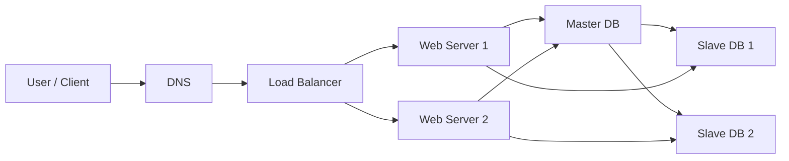

# Scale from Zero to Millions of Users 笔记

这份笔记整理自本地截图，主题是系统如何从单机架构逐步扩展到支持百万级用户。重点包括：单服务器架构、DNS 与 HTTP 请求流程、数据库拆分、关系型数据库与非关系型数据库、垂直扩展与水平扩展、负载均衡、数据库复制。

## 1. 从单服务器开始

系统设计可以从最简单的架构开始：所有东西都运行在一台服务器上。

单服务器通常包含：

- Web 应用
- API 服务
- 数据库
- 缓存
- 文件或静态资源

这种架构适合早期产品、原型系统或流量很小的服务。它的优点是简单、部署快、维护成本低；缺点是所有组件耦合在一起，任何一个部分出现瓶颈都会影响整个系统。

## 2. 用户访问网站的基本流程

用户可以通过浏览器或移动 App 访问系统。

典型请求流程：

1. 用户访问域名，例如 `www.mysite.com` 或 `api.mysite.com`。
2. 浏览器或 App 先向 DNS 查询域名对应的 IP 地址。
3. DNS 返回服务器 IP 地址。
4. 客户端用这个 IP 地址向 Web Server 发起 HTTP 请求。
5. Web Server 处理请求，返回 HTML 页面或 JSON 数据。

可以理解为：

```text
User -> DNS -> IP Address -> Web Server -> HTML/JSON Response
```

Web 应用和移动应用的流量来源可能不同：

- Web application：通常由服务端语言和前端技术共同实现，例如 Java、Python、HTML、JavaScript 等。
- Mobile application：通常通过 HTTP 协议访问后端 API，返回格式常见为 JSON。

JSON 是移动端与后端通信时很常见的数据格式。例如：

```json
{
  "id": 12,
  "firstName": "John",
  "lastName": "Smith",
  "address": {
    "streetAddress": "21 2nd Street",
    "city": "New York",
    "state": "NY",
    "postalCode": 10021
  },
  "phoneNumbers": [
    "212 555-1234",
    "646 555-4567"
  ]
}
```

## 3. 单服务器架构的问题

当用户量增长后，单服务器会遇到明显瓶颈：

- Web 服务和数据库抢占同一台机器资源。
- CPU、内存、磁盘和网络带宽都可能成为瓶颈。
- 单点故障严重，服务器宕机后整个系统不可用。
- 不方便独立扩展 Web 层和数据库层。

因此，下一步通常是把 Web 服务和数据库拆到不同服务器上。

## 4. 拆分 Web Server 和 Database

随着用户增长，一台服务器不够用，可以把系统拆成两部分：

- Web Server：处理业务逻辑、API 请求、页面返回。
- Database Server：专门负责数据读写和持久化。

拆分后的好处：

- Web 层和数据库层可以独立扩展。
- 数据库可以使用更适合存储的机器。
- Web Server 可以使用更适合计算和网络转发的机器。
- 系统职责更清晰，后续更容易加入缓存、负载均衡和数据库复制。

请求流程变成：

```text
Client -> DNS -> Web Server -> Database
```

Web Server 从数据库读取或写入数据，然后把结果返回给客户端。

## 5. 选择哪种数据库

常见数据库可以分为两大类：

- 关系型数据库：Relational Database，也叫 RDBMS 或 SQL Database。
- 非关系型数据库：Non-relational Database，也叫 NoSQL Database。

### 5.1 关系型数据库

关系型数据库把数据组织成表、行和列，可以用 SQL 进行查询和关联操作。

常见关系型数据库：

- MySQL
- PostgreSQL
- Oracle

关系型数据库适合：

- 数据结构清晰。
- 需要事务。
- 需要复杂查询。
- 需要 join 操作。
- 数据一致性要求较高。

典型例子：

- 订单系统
- 支付系统
- 用户账户
- 库存系统

### 5.2 非关系型数据库

非关系型数据库也叫 NoSQL，常见类型包括：

- Key-value store
- Graph store
- Column store
- Document store

常见 NoSQL 数据库：

- CouchDB
- Neo4j
- Cassandra
- HBase
- Amazon DynamoDB

NoSQL 通常适合：

- 超低延迟访问。
- 数据模型不固定。
- 不需要复杂关系 join。
- 只需要序列化和反序列化数据，例如 JSON、XML、YAML 等。
- 需要存储大量数据。

### 5.3 数据库选择思路

选择数据库时不要只看流行度，而要看业务需求：

- 需要事务和复杂查询：优先考虑关系型数据库。
- 数据结构灵活、规模巨大、访问模式简单：可以考虑 NoSQL。
- 需要强一致性：关系型数据库通常更自然。
- 需要高吞吐和水平扩展：NoSQL 常常更容易扩展。

## 6. 垂直扩展 vs 水平扩展

当流量增加后，需要扩展系统容量。常见方式有两种：

- 垂直扩展：Scale up
- 水平扩展：Scale out

### 6.1 垂直扩展

垂直扩展指增强单台服务器的能力，例如增加：

- CPU
- 内存
- 磁盘
- 网络能力

优点：

- 简单。
- 不需要明显改变系统架构。
- 适合早期或低流量系统。

缺点：

- 有硬件上限，不可能无限加 CPU 和内存。
- 没有容错能力，机器宕机后服务仍然不可用。
- 成本可能越来越高。
- 不适合大规模应用。

### 6.2 水平扩展

水平扩展指增加更多服务器，把请求分散到多台机器上。

优点：

- 更适合大规模系统。
- 可以逐步增加服务器。
- 更容易做高可用。
- 单台机器故障时，其他机器仍可继续服务。

缺点：

- 架构更复杂。
- 需要负载均衡。
- 需要考虑会话、缓存一致性、数据一致性等问题。

面试中通常更推荐水平扩展，因为它更符合大型系统的扩展方式。

## 7. 负载均衡 Load Balancer

当有多台 Web Server 时，需要一个组件把用户请求分发到不同服务器，这就是负载均衡器。

负载均衡器的作用：

- 分发请求到多台 Web Server。
- 提高系统可用性。
- 避免单台服务器过载。
- 当某台服务器宕机时，把流量转发到健康服务器。

加入负载均衡后的请求流程：

```text
User -> DNS -> Load Balancer -> Web Server 1 / Web Server 2 -> Database
```

### 7.1 公网 IP 和私网 IP

负载均衡架构里常见两类 IP：

- Public IP：公网 IP，用户可以从互联网访问。
- Private IP：私网 IP，只能在同一个私有网络内部访问。

常见设计：

- 用户只访问负载均衡器的公网 IP。
- Web Server 使用私网 IP。
- Web Server 不直接暴露在公网。
- 负载均衡器通过私网和 Web Server 通信。

这样可以提升安全性，因为外部用户不能直接访问后端服务器。

### 7.2 负载均衡解决的问题

如果 Server 1 下线：

- 所有流量会被路由到 Server 2。
- 网站不会直接不可用。
- 可以再添加新的健康服务器进入 server pool。

如果流量快速增长：

- 可以增加更多 Web Server。
- 负载均衡器会自动把请求分发给它们。

负载均衡让 Web 层具备更好的可用性和扩展性。

## 8. 数据库复制 Database Replication

当 Web 层可以水平扩展后，数据库仍然可能成为瓶颈。数据库复制是解决数据库高可用和读扩展的常见方式。

常见模型是 master-slave，也叫 primary-replica：

- Master Database：主库，负责写操作。
- Slave Database：从库，复制主库数据，负责读操作。

基本流程：

```text
Write -> Master DB
Master DB -> Replication -> Slave DB
Read -> Slave DB
```

### 8.1 为什么需要数据库复制

数据库复制的优点：

- 更好的性能：写请求进入主库，读请求分散到从库。
- 更高的可用性：数据库数据复制到多个位置，单点故障风险降低。
- 更好的可靠性：即使某个数据库节点损坏，数据仍然保存在其他节点。

在大多数应用中，读请求远多于写请求，所以多个从库可以显著提升读能力。

### 8.2 主从故障场景

如果只有一个从库，它下线了：

- 读请求可以临时转到主库。
- 系统可以创建新的从库来替代旧从库。
- 多个从库可用时，读请求会被转发到其他健康从库。

如果主库下线：

- 一个从库会被提升为新的主库。
- 所有数据库写操作临时切到新的主库。
- 系统需要创建新的从库补齐复制结构。

生产系统里，主从切换可能比图示复杂，因为：

- 新主库的数据可能不是最新。
- 可能存在复制延迟。
- 需要处理数据一致性。
- 需要补齐缺失数据。
- 多主复制和环形复制会进一步增加复杂度。

### 8.3 复制后的整体架构

加入负载均衡和数据库复制后，系统大致变成：

```text
User
  -> DNS
  -> Load Balancer
  -> Web Servers
  -> Master DB for writes
  -> Slave DBs for reads
```

特点：

- Web 层通过负载均衡实现水平扩展。
- 数据库层通过主从复制提升读性能和可用性。
- 写操作集中到主库。
- 读操作分散到多个从库。

## 9. 阶段性演进总结

从零到支持更多用户，系统通常按下面路径演进：

1. 单服务器：Web、数据库、缓存全部在一台机器上。
2. 拆分数据库：Web Server 和 Database 分离。
3. 选择合适数据库：根据数据模型和访问模式选择 SQL 或 NoSQL。
4. 垂直扩展：短期通过升级机器提升容量。
5. 水平扩展：增加多台 Web Server。
6. 加入负载均衡：把请求分发到多台服务器。
7. 数据库复制：主库处理写，从库处理读。

## 10. 面试复习重点

需要记住的核心点：

- 系统设计通常从简单架构开始，再逐步发现瓶颈并演进。
- DNS 负责把域名解析成 IP 地址。
- Web Server 可以返回 HTML，也可以为移动 App 返回 JSON。
- 数据库独立出来后，Web 层和数据层可以分别扩展。
- 关系型数据库适合结构化数据、事务和复杂查询。
- NoSQL 适合数据模型灵活、访问模式简单、数据量巨大的场景。
- 垂直扩展简单但有上限，而且不能解决单点故障。
- 水平扩展更适合大规模系统，但需要更复杂的架构。
- 负载均衡可以提高 Web 层可用性和扩展性。
- 数据库复制可以提升读性能、可用性和可靠性。
- 主从复制中，主库负责写，从库负责读。
- 故障切换时要考虑复制延迟和数据一致性。

## 11. 可直接背诵的回答

如果面试官问“系统如何从单机扩展到百万用户”，可以这样回答：

> 我会先从单服务器架构开始，Web 服务、数据库和缓存都在一台机器上。随着流量增长，第一步把数据库独立出来，让 Web 层和数据层可以分别扩展。接着根据业务数据模型选择 SQL 或 NoSQL。短期可以通过垂直扩展升级机器，但它有硬件上限，也不能解决单点故障，所以更长期的方案是水平扩展 Web Server，并在前面加入负载均衡器。负载均衡器负责把请求分发到多台健康服务器，提高可用性和吞吐量。数据库层面可以使用主从复制，主库处理写请求，从库处理读请求，这样能提升读性能和可靠性。如果主库或从库宕机，需要做故障切换，同时注意复制延迟和数据一致性问题。

## 12. 简化架构图



这张图对应的是一个比单机更成熟的基础架构：客户端先经过 DNS 和负载均衡器，到达多个 Web Server；写请求进入主库，读请求可以从从库读取。
