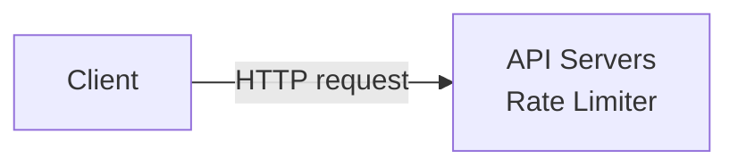
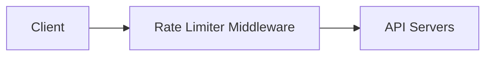
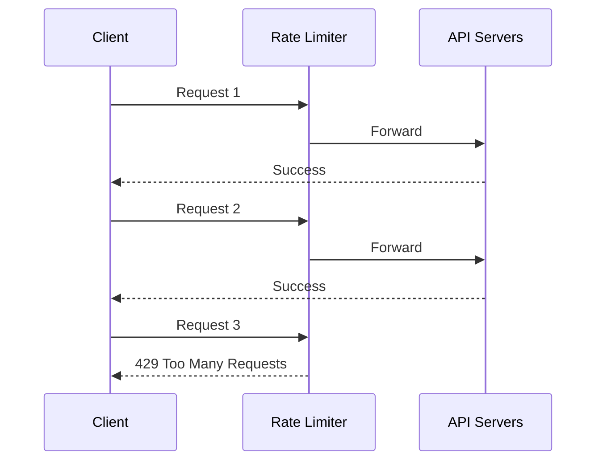
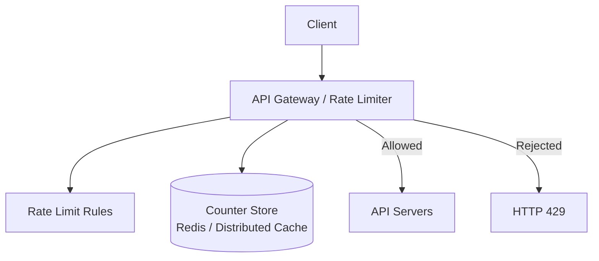

# 02. 限流器放在哪里与高层设计

## 1. Rate Limiter 应该放在哪里

Rate limiter 可以放在客户端侧，也可以放在服务端侧。截图中强调：直觉上你可以放在 client 或 server，但通常不建议依赖客户端限流。

## 2. Client-side Implementation

客户端实现的意思是：客户端自己控制请求频率。

优点：

- 实现简单。
- 可以提前减少无意义请求。
- 对友好客户端有帮助。

缺点：

- 客户端不可靠。
- 恶意用户可以绕过客户端逻辑。
- 客户端请求容易被伪造。
- 不同客户端版本可能规则不同。
- 服务端无法完全控制限流策略。

结论：客户端限流可以作为辅助，但不能作为主要安全控制。

## 3. Server-side Implementation

服务端实现的意思是：请求到达服务端后，由服务端检查是否超过限制。

截图中图 4-1 展示：Rate limiter 放在 API servers 里。

## 4. 图 4-1：服务端限流器

优点：

- 服务端可控。
- 不能被客户端绕过。
- 可以统一执行规则。
- 可以结合认证、IP、user ID、API key 等信息。

缺点：

- 每个请求都经过限流逻辑。
- 需要解决分布式状态共享问题。

## 5. Rate Limiter Middleware

除了直接放在 API server 里，也可以作为 middleware 放在 API server 前面。

截图中图 4-2 展示：客户端请求先经过 rate limiter middleware，再到 API servers。

## 6. 图 4-2：Rate Limiter Middleware

请求流程：

1. Client 发送请求。
2. Rate limiter middleware 检查请求是否超限。
3. 如果没超限，请求转发给 API servers。
4. 如果超限，middleware 直接返回 429。

## 7. 图 4-3：超过限制时返回 429

截图中例子：

- API 允许 2 requests per second。
- 客户端 1 秒内发送 3 个请求。
- 前两个请求通过。
- 第三个请求被拒绝，返回 HTTP 429。

## 8. API Gateway

截图中提到，Rate limiting 通常可以放在 API Gateway。

API Gateway 是一个 fully managed service，常见功能包括：

- Rate limiting
- SSL termination
- Authentication
- IP whitelisting
- Routing
- Service discovery
- Request transformation

把限流放在 API Gateway 的好处：

- 业务服务不需要重复实现限流。
- 多个服务共享统一规则。
- 更靠近入口，能更早挡住过量请求。
- 通常自带监控和配置能力。

## 9. Server-side vs Gateway 怎么选

截图中说没有绝对答案，取决于技术栈、资源、优先级和目标。

可以用这些准则：

### 9.1 看当前技术栈

如果当前已经使用 API Gateway，且它支持 rate limiting，可以优先使用 gateway。

如果没有 gateway，或者规则和业务高度绑定，可以在服务端实现。

### 9.2 选择适合业务的算法

不同限流算法适合不同业务：

- Token bucket：允许一定 burst，通用。
- Leaky bucket：输出平滑，适合稳定处理。
- Fixed window：简单但边界有突刺。
- Sliding window log：准确但耗内存。
- Sliding window counter：准确性和内存之间折中。

### 9.3 如果已经有微服务架构

如果系统已经有认证、IP 白名单、SSL termination 等逻辑在 API Gateway，通常可以把 rate limiting 也放在 gateway。

### 9.4 如果资源有限

自己实现一个商业级 rate limiting service 需要工程资源。如果时间或团队有限，可以使用成熟 gateway 或云服务能力。

## 10. 高层请求流程

## 11. 面试复习点

- 不要依赖客户端限流，客户端容易被绕过。
- 服务端限流更可靠。
- Rate limiter 可以放在 API server、middleware 或 API Gateway。
- API Gateway 适合统一入口限流。
- 超限请求通常返回 HTTP 429。
- 设计位置没有唯一答案，要结合技术栈和业务需求。
