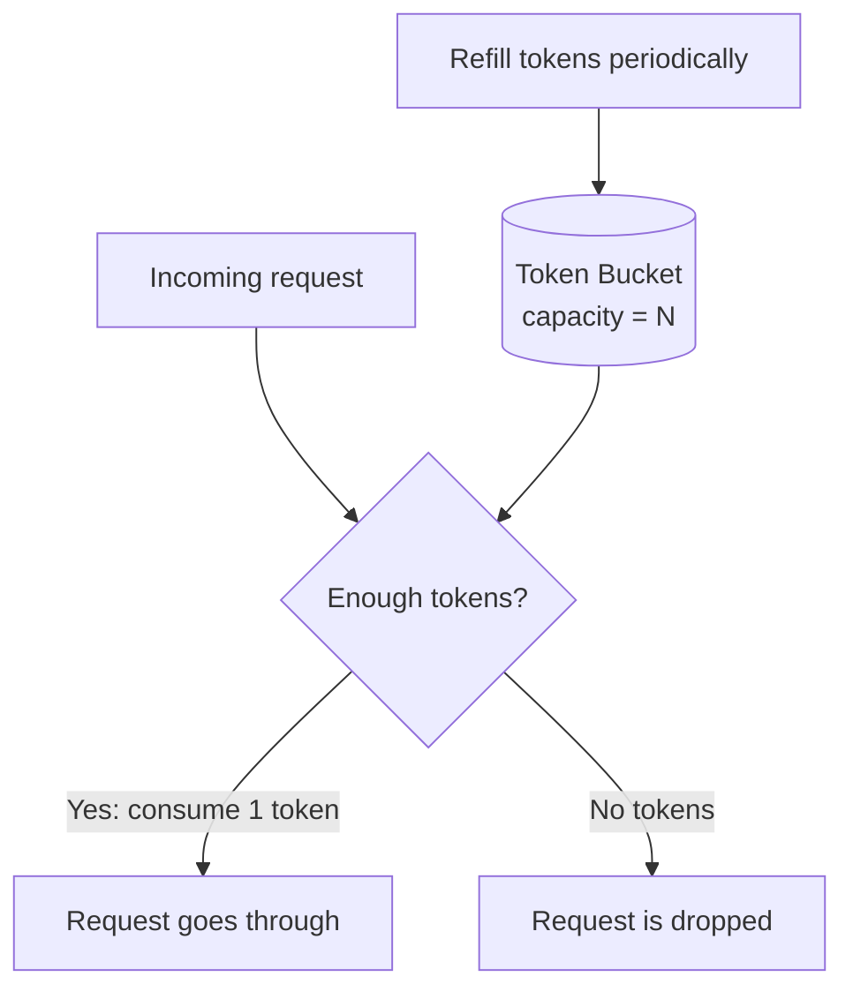
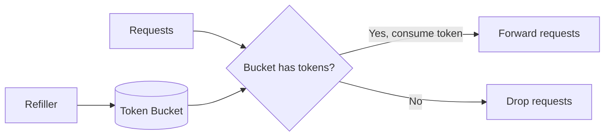
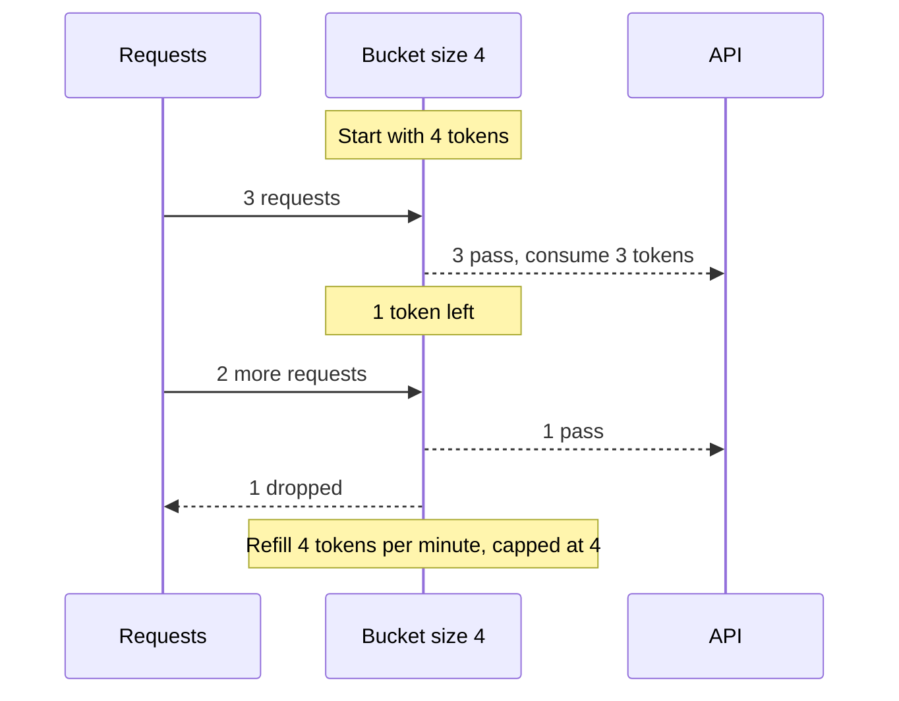
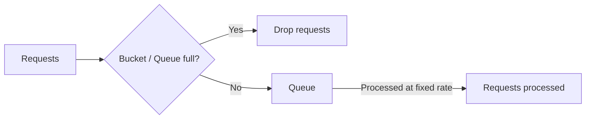
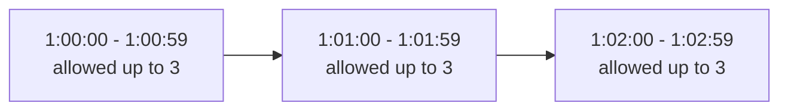
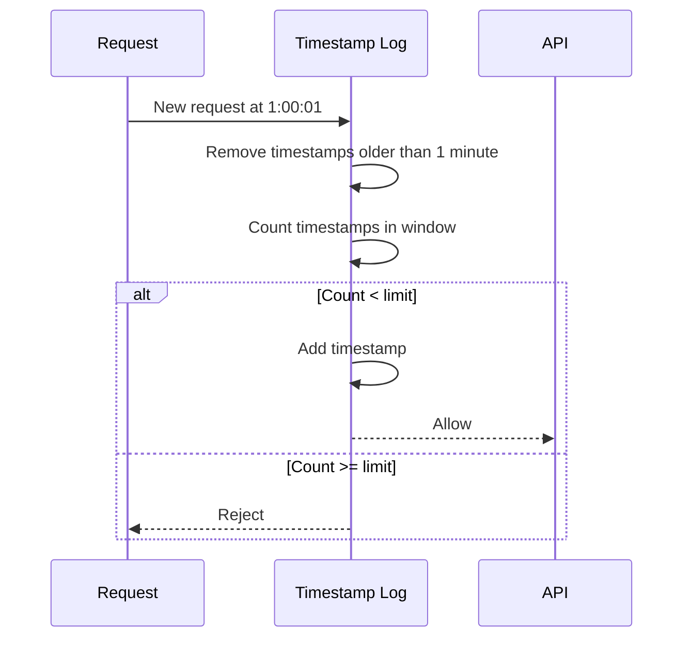
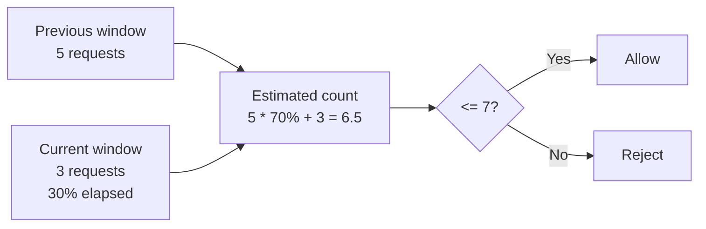

# 03. 限流算法详解

## 1. 常见限流算法

截图中列出常见算法：

- Token bucket
- Leaking bucket
- Fixed window counter
- Sliding window log
- Sliding window counter

每个算法都有优缺点，面试中不一定要全部实现，但要能解释适用场景和 trade-off。

## 2. 五个算法一句话抓重点

如果先不看公式，可以这样理解：

- Token bucket：系统按固定速度发“通行券”，请求来了要拿券，有券就过，没券就拒。
- Leaky bucket：请求先排队，系统按固定速度处理，队列满了就拒。
- Fixed window counter：每个固定时间段数请求数，超过就拒。
- Sliding window log：记录每个请求的精确时间，看最近一段时间内是否超限。
- Sliding window counter：固定窗口的改良版，用当前窗口加上一窗口的一部分来估算当前滑动窗口内请求数。

最容易混的是 token bucket 和 leaky bucket：

- Token bucket 允许突发：只要之前攒了 token，短时间内多个请求可以一起通过。
- Leaky bucket 不喜欢突发：请求排队后按固定速度放行，后端看到的是平滑流量。

## 3. 五个算法核心对比

假设规则都是“每分钟最多 100 次请求”。

| 算法 | 怎么判断 | 能否处理突发 | 准确性 | 内存 | 适合场景 |
|---|---|---|---|---|---|
| Token bucket | 桶里有没有 token | 可以 | 中高 | 低 | 普通 API 限流，允许短时间突发 |
| Leaky bucket | 队列满不满 | 不太允许，会排队匀速处理 | 中 | 低 | 保护下游服务，希望请求匀速进入 |
| Fixed window counter | 当前固定窗口计数是否超过限制 | 窗口边界会放大突发 | 较低 | 很低 | 要求不严格、实现简单优先 |
| Sliding window log | 最近 N 秒内精确请求数是否超过限制 | 控制严格 | 最高 | 高 | 登录防刷、安全风控、金融接口 |
| Sliding window counter | 当前窗口 + 上一窗口加权估算 | 比固定窗口好 | 中高 | 低 | 工程上常用的准确性和性能折中 |

选型口诀：

- 最简单：fixed window counter。
- 最准确：sliding window log。
- 准确和省内存折中：sliding window counter。
- 允许短时间突发：token bucket。
- 强制稳定处理速度：leaky bucket。

## 4. Token Bucket Algorithm

Token bucket 是最常用的限流算法之一，很多互联网公司使用它，例如 Amazon 和 Stripe。

核心思想：

- 有一个 bucket，容量固定。
- 系统按照固定速率往 bucket 里放 tokens。
- 每个请求到来时消耗一个 token。
- 如果 bucket 里有 token，请求通过。
- 如果没有 token，请求被拒绝。
- bucket 满了以后，多余 token 会溢出，不再增加。

## 5. 图 4-4：Token Bucket 基本模型



## 6. 图 4-5：Token Bucket 请求处理流程



## 7. 图 4-6：Token Bucket 示例

截图中例子：

- Bucket size = 4。
- Refill rate = 4 tokens / minute。

过程：

1. 开始有 4 个 tokens，请求通过并消耗 tokens。
2. 如果短时间内来了 3 个请求，消耗 3 个 tokens。
3. 如果 bucket 里没有 token，请求被拒绝。
4. 每分钟补充 4 个 tokens。



## 8. Token Bucket 参数

Token bucket 有两个关键参数：

### 6.1 Bucket Size

Bucket size 是 bucket 能容纳的最大 token 数量。

它决定允许多少短时间 burst。

例如：

- bucket size = 4，最多可以瞬间通过 4 个请求。
- bucket size = 100，允许更大的突发流量。

### 6.2 Refill Rate

Refill rate 是系统每秒或每分钟放入 bucket 的 token 数量。

它决定长期平均速率。

例如：

- 4 tokens / minute。
- 100 tokens / second。

## 9. 需要多少个 Bucket

Bucket 数量取决于限流规则。

例子：

- 如果按 user 限流，每个 user 一个 bucket。
- 如果按 IP 限流，每个 IP 一个 bucket。
- 如果按 endpoint 限流，每个 endpoint 一个 bucket。
- 如果一个用户对多个 API 有不同限额，可以为不同 API 建不同 bucket。

截图中例子：

- 用户每天最多发 1 post。
- 用户每天最多加 150 friends。
- 每个用户需要 2 个 buckets。

## 10. Token Bucket 优缺点

优点：

- 算法简单。
- 内存效率较好。
- 允许短时间 burst。
- 适合大多数 API 限流场景。

缺点：

- 需要调两个参数：bucket size 和 refill rate。
- 参数设置不好会造成过松或过严。

一句话总结：Token bucket 管的是“有没有额度”。如果之前没用完额度，额度可以攒起来，所以它允许短时间突发，但长期平均速率仍然被 refill rate 控制。

适合：

- 普通 API 调用。
- 消息发送。
- 上传接口。
- 用户偶尔集中发请求也可以接受的场景。

## 11. Leaky Bucket Algorithm

Leaky bucket 和 token bucket 类似，但工作方式不同。

核心思想：

- 请求进入一个 queue。
- queue 以固定速率流出请求。
- 如果 queue 满了，新请求被丢弃。

它像一个漏水的桶：水可以突发进入桶，但流出速度固定。

## 12. 图 4-7：Leaky Bucket 工作流程



## 13. Leaky Bucket 参数

Leaky bucket 有两个关键参数：

### 11.1 Bucket Size

队列大小，决定最多可以排队多少请求。

### 11.2 Outflow Rate

固定处理速率，决定每秒或每分钟处理多少请求。

## 14. Leaky Bucket 优缺点

优点：

- 内存效率高，因为 queue 大小固定。
- 请求按固定速率处理。
- 适合需要稳定输出速率的场景。

缺点：

- 突发流量会填满队列，旧请求如果不能及时处理，新的请求会被限流。
- 参数有两个，调参不容易。
- 可能增加请求等待时间。

一句话总结：Leaky bucket 管的是“匀速处理”。它会把突发请求削平，让后端按固定速度接收请求。

适合：

- 后端不能承受突发流量。
- 必须匀速处理的场景。
- 支付、写数据库、调用脆弱下游服务等保护性限流。

## 15. Fixed Window Counter Algorithm

Fixed window counter 把时间切成固定窗口，每个窗口维护一个 counter。

规则：

- 每个窗口开始时 counter 重置为 0。
- 每个请求到来时 counter +1。
- 如果 counter 小于等于阈值，请求通过。
- 如果 counter 超过阈值，请求被拒绝。

## 16. 图 4-8 / 4-9：Fixed Window 示例

例子：

- 每分钟最多 3 个请求。
- 每个分钟窗口独立计数。
- 超过 3 个的请求被拒绝。



固定窗口的问题在边界处最明显：

- 1:00:58 到 1:00:59 通过 3 个请求。
- 1:01:00 到 1:01:01 又通过 3 个请求。
- 2 秒内实际通过了 6 个请求。

这会形成 burst。

## 17. Fixed Window 优缺点

优点：

- 内存效率高。
- 容易理解。
- 实现简单。
- 适合某些粗粒度限流。

缺点：

- 窗口边界可能出现流量突刺。
- 在窗口边缘通过的请求可能超过期望速率。

一句话总结：Fixed window 简单、省内存，但不看真实最近 60 秒，只看自然窗口，所以窗口边界会放过过多请求。

适合：

- 要求不严格。
- 实现简单优先。
- 粗粒度限流。

## 18. Sliding Window Log Algorithm

Sliding window log 记录每个请求的 timestamp。

流程：

1. 新请求到达。
2. 删除所有已经过期的 timestamps。
3. 统计当前窗口内的 timestamps 数量。
4. 如果数量小于限制，请求通过，并把当前 timestamp 加入 log。
5. 如果数量达到限制，请求被拒绝。

## 19. 图 4-10：Sliding Window Log 示例

假设允许每分钟 2 个请求。



## 20. Sliding Window Log 优缺点

优点：

- 非常准确。
- 没有 fixed window 的边界突刺问题。

缺点：

- 内存消耗大。
- 即使请求被拒绝，timestamp 可能仍需要存储或检查。
- 高流量场景下日志量很大。

一句话总结：Sliding window log 最精确，因为它真的检查“最近 N 秒”内发生了多少请求。

适合：

- 登录防刷。
- 安全风控。
- 金融接口。
- 任何非常需要准确限流的场景。

## 21. Sliding Window Counter Algorithm

Sliding window counter 是 fixed window counter 和 sliding window log 的混合方案。

核心思想：

- 使用当前窗口和上一个窗口的计数。
- 根据当前窗口经过的比例，对上一个窗口的计数加权。
- 估算当前滑动窗口内的请求数量。

公式：

```text
estimated_count =
  previous_window_count * overlap_ratio
  + current_window_count
```

截图中的例子：

- 限制：每分钟最多 7 个请求。
- 前一分钟有 5 个请求。
- 当前分钟到达 30% 位置。
- 当前分钟有 3 个请求。

计算：

```text
5 * 70% + 3 = 6.5
```

根据实现可以向下取整为 6，因此请求通过。

## 22. 图 4-11：Sliding Window Counter 示例



## 23. Sliding Window Counter 优缺点

优点：

- 平滑 fixed window 的突刺。
- 内存效率好。
- 容易理解。
- 比 sliding window log 更省内存。

缺点：

- 只是近似值，不是绝对精确。
- 对流量分布有假设，某些场景会有误差。

一句话总结：Sliding window counter 比 fixed window 更平滑，比 sliding window log 更省内存，是很多工程场景中的折中方案。

适合：

- 大多数通用限流。
- 希望准确性比 fixed window 更好。
- 但又不想保存每个请求 timestamp。

## 24. 面试中怎么选算法

如果面试官问“设计一个 API rate limiter”，一个稳妥回答是：

- 普通 API 限流：优先考虑 token bucket，因为它支持一定突发，同时控制长期平均速率。
- 希望任意时间窗口内比较公平：考虑 sliding window counter。
- 极高精度场景：考虑 sliding window log，但要说明内存成本高。
- 后端必须匀速处理：选择 leaky bucket。
- 简单限流或低风险内部接口：fixed window counter 可以接受。

最常被考的点：

- Token bucket。
- Sliding window counter。
- Redis 实现。
- HTTP 429。
- 分布式环境中的共享计数和原子操作。

一句话背诵：

> 令牌桶管“有没有额度”，漏桶管“匀速处理”，固定窗口简单但边界不准，滑动窗口日志最精确但费内存，滑动窗口计数器是工程上常用的折中。

## 25. 算法对比

| 算法 | 优点 | 缺点 | 适合场景 |
|---|---|---|---|
| Token bucket | 简单、省内存、允许 burst | 需要调 bucket size 和 refill rate | 通用 API 限流 |
| Leaky bucket | 输出平滑、固定处理速率 | burst 时排队或丢弃，可能增加延迟 | 需要稳定处理速率 |
| Fixed window | 简单、省内存 | 窗口边界会突刺 | 粗粒度限流 |
| Sliding window log | 准确 | 耗内存 | 精确限流、低流量 |
| Sliding window counter | 平滑、省内存 | 近似估算 | 大多数需要折中的场景 |

## 26. 面试复习点

- Token bucket 最常用，允许 burst。
- Leaky bucket 输出速率固定。
- Fixed window 简单，但窗口边界有突刺。
- Sliding window log 准确但耗内存。
- Sliding window counter 在准确性和内存之间折中。
- 算法选择要结合业务能否接受 burst、是否要求精确、系统流量规模和内存限制。
- 面试不会要求死背五个算法，而是看你能不能根据业务场景选合适方案。
