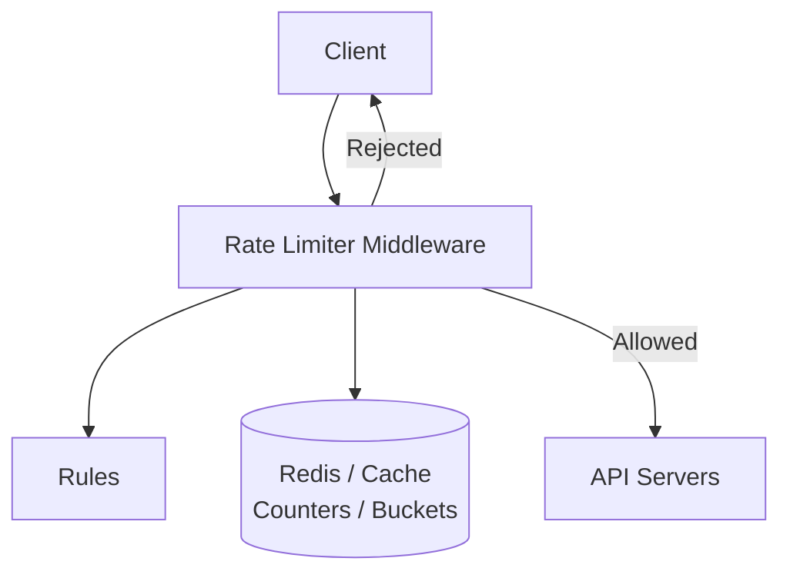
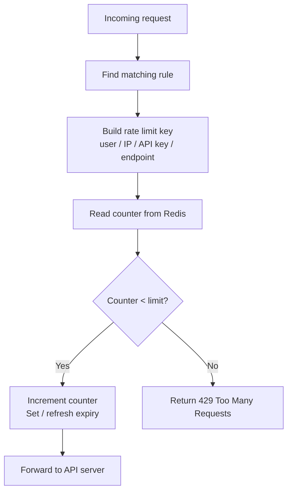

# 04. 规则配置、深挖设计与面试总结

## 1. Step 3：Design Deep Dive

高层设计通常还不够，需要回答：

- 限流规则如何创建？
- 规则存储在哪里？
- 如何处理被限流的请求？
- 如何在分布式环境中限流？
- 如何优化性能？
- 如何监控限流效果？

## 2. Rate Limiting Rules

截图中提到，很多商业 rate limiting 组件支持开源或声明式规则。规则通常写在配置文件中并保存在磁盘或配置中心。

规则例子：

```yaml
domain: messaging
descriptors:
  - key: message_type
    value: marketing
    rate_limit:
      unit: day
      requests_per_unit: 5
```

含义：

- domain 是 `messaging`。
- 限流维度是 `message_type = marketing`。
- 每天最多 5 个 marketing messages。

另一个例子：

```yaml
domain: auth
descriptors:
  - key: auth_type
    value: login
    rate_limit:
      unit: minute
      requests_per_unit: 5
```

含义：

- 认证场景。
- 登录类型请求。
- 每分钟最多 5 次 login。

这种规则说明：规则通常不是写死在代码里，而是配置化。

## 3. 图 4-12：高层 Rate Limiter 架构

截图中图 4-12 展示了 rate limiter middleware 和后端存储的关系：



流程：

1. Client 发送请求到 rate limiter middleware。
2. Rate limiter 从规则配置中读取适用规则。
3. Rate limiter 从 Redis / cache 获取 counter。
4. 如果未超过限制，请求进入 API servers。
5. 如果超过限制，请求被拒绝。
6. 如果未超过限制，counter 增加并保存回 Redis。

## 4. Redis 中的限流状态

截图中提到，使用数据库保存 counter 不理想，因为访问磁盘慢。内存缓存更适合；Redis 是常见选择。

Redis 适合原因：

- 内存存储，速度快。
- 支持过期时间。
- 支持原子操作。
- 支持 INCR。
- 支持 EXPIRE。

常见操作：

```text
INCR key
EXPIRE key seconds
```

例子：

```text
rate_limit:user:123:login:2026-07-03-10:01 -> 3
```

## 5. 请求通过或拒绝的流程



## 6. 限流响应

当请求被限流时，常见返回：

```text
HTTP/1.1 429 Too Many Requests
Retry-After: 60
X-RateLimit-Limit: 100
X-RateLimit-Remaining: 0
X-RateLimit-Reset: 1720000000
```

常见响应头：

- `X-RateLimit-Limit`：窗口内总额度。
- `X-RateLimit-Remaining`：剩余额度。
- `X-RateLimit-Reset`：额度重置时间。
- `Retry-After`：多久后可以重试。

## 7. 分布式环境的问题

在分布式系统中，rate limiter middleware 可能有多个实例。

问题：

- 同一个用户的请求可能打到不同实例。
- 如果每个实例本地计数，会绕过全局限制。
- 多实例同时更新 counter，可能有竞态条件。

解决：

- 使用共享 Redis。
- 使用原子操作。
- 使用 Lua script 保证检查和递增原子化。
- 使用分布式缓存集群提升吞吐。

## 8. 原子性问题

限流判断通常有两个动作：

1. 检查 counter 是否小于 limit。
2. 如果小于，counter +1。

如果这两个动作不是原子的，并发请求可能同时看到 counter 还没超限，然后一起通过，导致超额。

解决方式：

- Redis Lua script。
- Atomic increment。
- Transaction。
- Compare-and-set。

## 9. 性能优化

Rate limiter 位于请求路径上，所以要低延迟。

优化方式：

- 使用内存存储，例如 Redis。
- 规则本地缓存，避免每次查配置中心。
- Redis 就近部署。
- 批量或 pipeline 操作。
- 对低风险接口使用宽松规则。
- 使用 API Gateway 内置限流能力。

## 10. 高可用与故障策略

Rate limiter 自身也可能故障。

需要决定：

### 10.1 Fail Open

限流器不可用时放行请求。

优点：

- 不影响正常用户。
- 可用性高。

缺点：

- 攻击或突发流量可能打到后端。

### 10.2 Fail Closed

限流器不可用时拒绝请求。

优点：

- 保护后端。

缺点：

- 正常用户也可能被拒绝。
- 可用性变差。

真实系统通常按接口重要性选择：

- 登录、支付等核心路径可能更偏 fail open 或降级。
- 高风险、昂贵接口可能更偏 fail closed。

## 11. 监控指标

需要监控：

- 总请求数。
- 被限流请求数。
- 429 比例。
- Redis 延迟。
- Redis 错误率。
- 每条规则的命中次数。
- 每个 endpoint 的限流情况。
- Top throttled users / IPs。
- Rate limiter 自身延迟。

这些指标帮助判断：

- 限流规则是否过严。
- 是否存在攻击。
- 是否有客户端 bug。
- Redis 是否成为瓶颈。

## 12. 面试回答模板

如果面试官问“设计一个 API rate limiter”，可以这样回答：

> 我会先确认限流范围：是服务端 API rate limiter，支持按 user ID、IP、API key、endpoint 等维度限流。需求上要保证低延迟、内存效率、分布式限流、异常处理和高容错。高层设计上，我会把 rate limiter 放在 API gateway 或 server-side middleware，所有请求先经过限流器。限流器读取规则配置，根据请求生成限流 key，然后在 Redis 中读取并更新 counter 或 bucket 状态。如果未超限，请求转发给 API server；如果超限，返回 HTTP 429，并带上 Retry-After 和 X-RateLimit 相关响应头。算法上可以用 token bucket，因为它简单、省内存并允许一定 burst；如果需要更平滑输出可以用 leaky bucket，如果要准确滑动窗口可以用 sliding window log 或 sliding window counter。分布式环境中要使用共享存储和原子操作，比如 Redis Lua script，避免并发请求绕过限制。最后要监控 429 比例、规则命中、Redis 延迟和限流器自身延迟。

## 13. 最终复习重点

- Rate limiter 控制单位时间内允许的请求数量。
- 限流对象可以是 user、IP、device、API key、endpoint。
- 服务端或 API Gateway 限流比客户端限流可靠。
- 超限常返回 HTTP 429。
- Token bucket 通用且允许 burst。
- Leaky bucket 输出平滑。
- Fixed window 简单但边界可能突刺。
- Sliding window log 精确但耗内存。
- Sliding window counter 是准确性和内存之间的折中。
- 分布式限流要用共享存储和原子操作。
- Redis 常用于保存 counter / bucket 状态。
- 限流器也要考虑故障策略、监控和规则配置。
