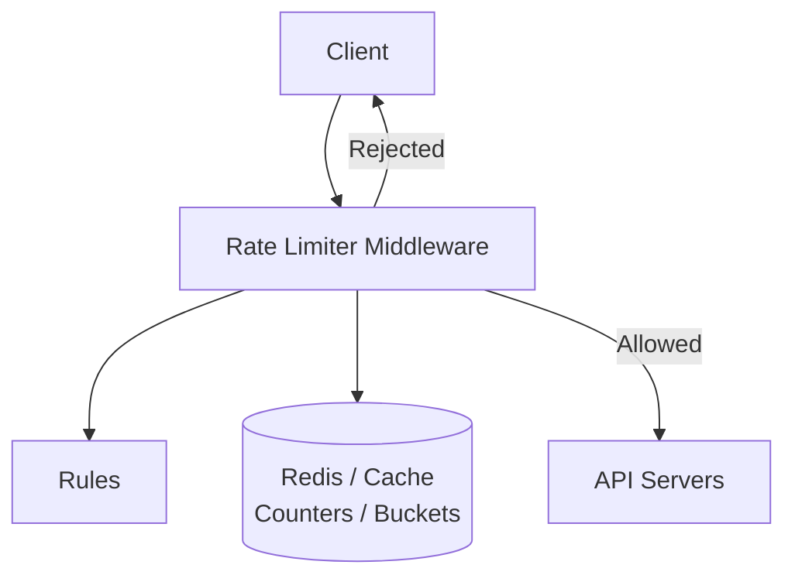
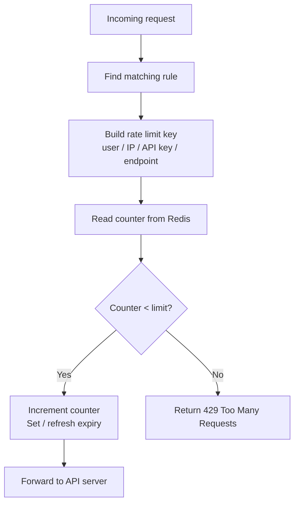
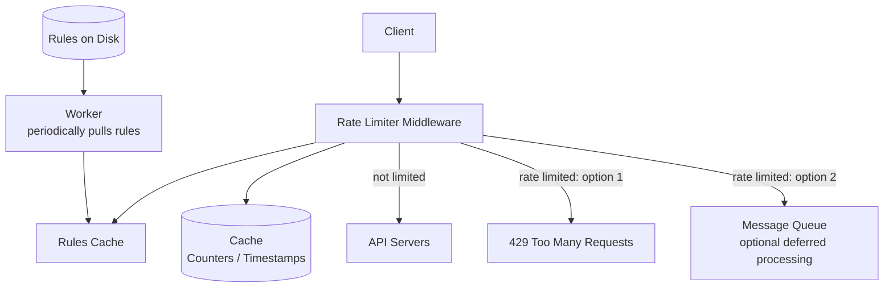
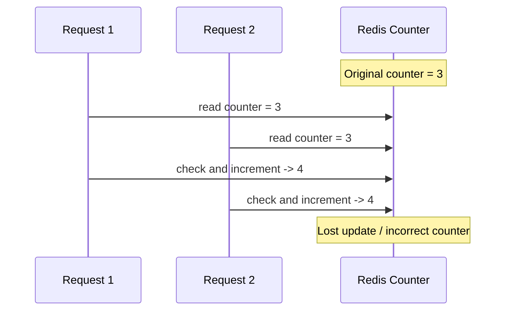
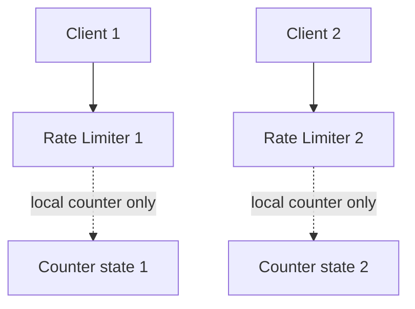
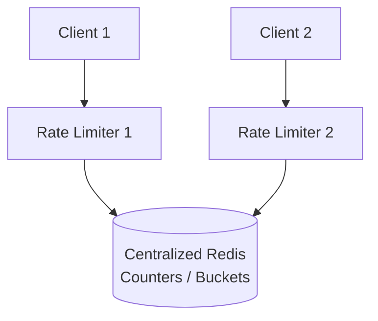
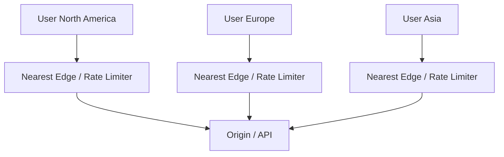

# 04. 规则配置、深挖设计与面试总结

## 1. Step 3：Design Deep Dive

高层设计通常还不够，需要回答：

- 限流规则如何创建？
- 规则存储在哪里？
- 如何处理被限流的请求？
- 如何在分布式环境中限流？
- 如何优化性能？
- 如何监控限流效果？

## 2. Rate Limiting Rules

截图中提到，很多商业 rate limiting 组件支持开源或声明式规则。规则通常写在配置文件中并保存在磁盘或配置中心。

规则例子：

```yaml
domain: messaging
descriptors:
  - key: message_type
    value: marketing
    rate_limit:
      unit: day
      requests_per_unit: 5
```

含义：

- domain 是 `messaging`。
- 限流维度是 `message_type = marketing`。
- 每天最多 5 个 marketing messages。

另一个例子：

```yaml
domain: auth
descriptors:
  - key: auth_type
    value: login
    rate_limit:
      unit: minute
      requests_per_unit: 5
```

含义：

- 认证场景。
- 登录类型请求。
- 每分钟最多 5 次 login。

这种规则说明：规则通常不是写死在代码里，而是配置化。

## 3. 图 4-12：高层 Rate Limiter 架构

截图中图 4-12 展示了 rate limiter middleware 和后端存储的关系：



流程：

1. Client 发送请求到 rate limiter middleware。
2. Rate limiter 从规则配置中读取适用规则。
3. Rate limiter 从 Redis / cache 获取 counter。
4. 如果未超过限制，请求进入 API servers。
5. 如果超过限制，请求被拒绝。
6. 如果未超过限制，counter 增加并保存回 Redis。

## 4. Redis 中的限流状态

截图中提到，使用数据库保存 counter 不理想，因为访问磁盘慢。内存缓存更适合；Redis 是常见选择。

Redis 在限流中的作用可以白话理解为：帮所有 API server 共享同一个计数器。

真实系统通常有很多台服务器：

```text
API Server 1
API Server 2  -> Redis 记录 user_123 请求了几次
API Server 3
```

如果每台机器自己数，请求打到不同机器时，计数就乱了。Redis 很快，并且可以设置过期时间，所以常用来保存限流状态。

Redis 适合原因：

- 内存存储，速度快。
- 支持过期时间。
- 支持原子操作。
- 支持 INCR。
- 支持 EXPIRE。

常见操作：

```text
INCR key
EXPIRE key seconds
```

例子：

```text
rate_limit:user:123:login:2026-07-03-10:01 -> 3
```

固定窗口限流的 key 可能长这样：

```text
key = rate_limit:user_123:2026-07-03-10:01
value = 3
expire = 60 秒
```

每来一个请求，Redis 中的 value 加 1。如果超过阈值，就拒绝。

## 5. 请求通过或拒绝的流程



## 6. 限流响应

当请求被限流时，常见返回：

```text
HTTP/1.1 429 Too Many Requests
Retry-After: 60
X-RateLimit-Limit: 100
X-RateLimit-Remaining: 0
X-RateLimit-Reset: 1720000000
```

常见响应头：

- `X-RateLimit-Limit`：窗口内总额度。
- `X-RateLimit-Remaining`：剩余额度。
- `X-RateLimit-Reset`：额度重置时间。
- `Retry-After`：多久后可以重试。

## 7. Exceeding the Rate Limit

当请求超过限流阈值时，API 通常返回 `429 Too Many Requests`。但是实际系统里，并不是所有超限请求都要立刻丢弃，也可以根据业务重要性延迟处理。

例子：

- 用户实时请求登录接口，超过限制后应该立即返回 429。
- 某些订单处理任务可能因为系统过载被放入队列，稍后再处理。
- 非核心后台任务可以被延迟。

也就是说，超限策略可以是：

- 直接拒绝。
- 放入 message queue 稍后处理。
- 降级处理。
- 返回重试时间，让客户端稍后再试。

## 8. Rate Limiter Headers

客户端需要知道自己是否被限流，以及还剩多少额度。截图中列出三个常见响应头：

### 8.1 X-RateLimit-Remaining

表示当前窗口中还剩多少请求额度。

```text
X-RateLimit-Remaining: 12
```

### 8.2 X-RateLimit-Limit

表示当前窗口中客户端最多能发多少请求。

```text
X-RateLimit-Limit: 100
```

### 8.3 X-RateLimit-Retry-After

表示被限流后需要等待多少秒才能再次请求而不被 throttled。

```text
X-RateLimit-Retry-After: 60
```

有些系统也使用标准头：

```text
Retry-After: 60
```

## 9. 图 4-13：Detailed Design

截图中的 detailed design 包含：

- Rate limiter middleware。
- Rules 存储在磁盘，worker 定期拉取规则并缓存。
- Rate limiter 从 cache 读取 counters 和 last request timestamp。
- 请求没被限流时转发到 API servers。
- 请求被限流时可以返回 429，也可以进入 message queue 稍后处理。



处理逻辑：

1. Rules 存在磁盘或配置中心。
2. Worker 定期拉取 rules，放入 cache。
3. 请求进入 rate limiter middleware。
4. Middleware 从 rules cache 找到匹配规则。
5. Middleware 从 Redis/cache 获取 counter 和 timestamp。
6. 如果未超限，请求转发到 API servers，并更新 counter。
7. 如果超限，返回 429 或放入 queue。

## 10. 分布式环境的问题

在分布式系统中，rate limiter middleware 可能有多个实例。

问题：

- 同一个用户的请求可能打到不同实例。
- 如果每个实例本地计数，会绕过全局限制。
- 多实例同时更新 counter，可能有竞态条件。

解决：

- 使用共享 Redis。
- 使用原子操作。
- 使用 Lua script 保证检查和递增原子化。
- 使用分布式缓存集群提升吞吐。

## 11. Race Condition 竞态条件

限流判断通常有两个动作：

1. 检查 counter 是否小于 limit。
2. 如果小于，counter +1。

如果这两个动作不是原子的，并发请求可能同时看到 counter 还没超限，然后一起通过，导致超额。

白话例子：

```text
规则：最多 5 次
Redis 当前计数：4

请求 A 读 Redis：现在是 4，4 + 1 = 5，可以通过
请求 B 读 Redis：现在也是 4，4 + 1 = 5，也可以通过

实际结果：两个请求都通过，总数变成 6，已经超限
```

这就是竞争条件：多个请求同时读写同一个计数器，导致判断不准。

解决方式：

- Redis Lua script。
- Atomic increment。
- Transaction。
- Compare-and-set。

## 12. 图 4-14：竞态条件示例

截图中举例：

- Redis 中 counter 当前值是 3。
- 两个请求几乎同时读取 counter。
- 两个线程都认为 `counter + 1` 没有超过阈值。
- 两个线程都把 counter 写回 4。
- 实际上应该有一次写成 5 或其中一个被拒绝。



解决方式：

- Redis Lua script：把读取、检查、递增放在同一个原子脚本中。
- Redis transaction。
- Atomic INCR + TTL。
- CAS，但在高并发下可能重试较多。

核心原则：

```text
检查 + 更新 必须原子化，不能分开执行。
```

## 13. Synchronization Issue 同步问题

截图中提到，另一个分布式挑战是 synchronization。

如果使用多个 rate limiter servers：

- Client 1 可能访问 Rate Limiter 1。
- Client 2 可能访问 Rate Limiter 2。
- 如果每个 limiter 本地保存计数，就会出现不一致。

## 14. 图 4-15：不同 Rate Limiter 之间状态不一致



如果 Client 1 和 Client 2 属于同一个用户，但请求打到不同 limiter，本地 counter 不能反映全局请求数。

白话例子：

```text
用户 A -> 限流器 1，限流器 1 觉得用户 A 请求了 3 次
用户 A -> 限流器 2，限流器 2 觉得用户 A 请求了 3 次
用户 A -> 限流器 3，限流器 3 觉得用户 A 请求了 3 次
```

每个限流器都觉得没超，但用户实际可能已经请求了 9 次。

## 15. 图 4-16：使用集中式 Redis 解决同步问题

截图中建议不要用 sticky session，因为它 neither scalable nor flexible。更好的方式是使用 centralized data store，例如 Redis。



优点：

- 多个 rate limiter 共享同一份 counter。
- 更容易水平扩展 limiter instances。
- 避免 sticky session。

缺点：

- Redis 成为核心依赖。
- Redis 需要高可用。
- Redis 延迟会影响请求路径。

## 16. Performance Optimization 性能优化

Rate limiter 位于请求路径上，性能非常重要。

截图中提到两个方向：

### 16.1 多数据中心与边缘部署

如果 rate limiter 部署在离用户很远的地方，延迟会很高。可以把 rate limiter 放到多个 data centers 或 edge servers。

例如 Cloudflare 在全球有许多 edge servers，流量会自动路由到最近的 edge server 以降低延迟。



### 16.2 最终一致性同步

第二个优化方向是同步数据时使用 eventual consistency model。如果要求所有节点强一致，延迟和复杂度会变高。

对于很多限流场景，短暂误差可以接受：

- 某个用户可能多通过几个请求。
- 几秒后全局状态收敛。

但对支付、风控等高风险接口，可能需要更强一致。

## 17. Monitoring 监控

截图中强调，rate limiter 上线后要持续收集 analytics data，检查它是否有效。

重点监控：

- Rate limiting algorithm 是否有效。
- Rate limiting rules 是否有效。
- 429 数量和比例。
- 被限流最多的用户、IP、API key。
- Rate limiter latency。
- Redis latency / error rate。
- Allow / reject ratio。
- 每个 endpoint 的限流命中率。

监控能帮助发现：

- 规则设置太宽，限流没起作用。
- 规则设置太严，正常用户被误伤。
- 突发流量或攻击。
- 客户端 bug 导致重复请求。
- Redis 或 limiter 自身成为瓶颈。

一个常见问题：最初设置的规则可能很有效，但随着流量增长，规则可能变得无效。例如 flash sale 期间，正常流量也可能被误判为异常。此时可能要动态调整 bucket size、refill rate 或阈值。

## 18. 高可用与故障策略

Rate limiter 自身也可能故障。

需要决定：

### 18.1 Fail Open

限流器不可用时放行请求。

优点：

- 不影响正常用户。
- 可用性高。

缺点：

- 攻击或突发流量可能打到后端。

适合：

- 普通业务接口。
- 浏览商品。
- 看评论。
- 用户体验优先的读请求。

### 18.2 Fail Closed

限流器不可用时拒绝请求。

优点：

- 保护后端。

缺点：

- 正常用户也可能被拒绝。
- 可用性变差。

适合：

- 登录。
- 支付。
- 验证码。
- 风控。
- 高风险或成本昂贵接口。

真实系统通常按接口重要性选择：

- 登录、支付等核心路径可能更偏 fail open 或降级。
- 高风险、昂贵接口可能更偏 fail closed。

## 19. Step 4：Wrap Up

本章最后总结，rate limiter 的设计讨论了：

- Algorithms
- Data structures
- Architecture
- Performance optimization
- Monitoring

还可以补充几个面试加分点。

### 19.1 Hard vs Soft Rate Limiting

Hard rate limiting：

- 请求数不能超过阈值。
- 超过就拒绝。
- 更严格。

Soft rate limiting：

- 请求可以短时间超过阈值。
- 系统可能先允许 burst，然后慢慢收紧。
- 对用户体验更友好。

### 19.2 不同层级限流

截图中提到本章只讨论 application layer，也就是 HTTP layer。

实际上还可以在其他层限流：

- Layer 3：IP 层限流。
- Layer 4：Transport layer 限流。
- Layer 7：Application / HTTP 层限流。

本章重点是 HTTP API rate limiter。

### 19.3 避免自己成为限流对象

客户端也应该遵守最佳实践：

- 使用 client cache，减少 API calls。
- 理解并尊重 rate limit。
- 不要在短时间内发送过多请求。
- 对异常和 429 做退避重试。
- 给重试逻辑加 backoff。

## 20. 面试回答顺序

如果面试官问“设计一个 API Rate Limiter”，可以按这个顺序回答。

第一步，问需求：

```text
按 userId 限流，还是按 IP / API key / deviceId 限流？
限流规则是多少？每秒、每分钟、每天？
是否需要支持分布式？
被限流后直接拒绝，还是排队稍后处理？
```

第二步，说高层架构：

```text
请求先经过 API Gateway / Rate Limiter Middleware。
限流器根据 userId / IP / API key 生成限流 key。
然后去 Redis 查询和更新计数。
如果没超过限制，请求转发到后端。
如果超过限制，返回 HTTP 429。
```

第三步，说算法：

```text
普通 API 限流可以用令牌桶或滑动窗口计数器。
令牌桶允许短时间突发，适合大多数 API。
滑动窗口计数器比固定窗口更平滑，内存也比滑动窗口日志低。
登录防刷这种要求准确的场景，可以用滑动窗口日志。
```

第四步，说分布式问题：

```text
多台服务器必须共享限流状态，所以用 Redis。
检查和增加计数要原子化，可以用 Redis Lua script。
```

第五步，说异常处理：

```text
超限返回 429，并带 Retry-After。
Redis 挂了时，普通接口可以 fail open，敏感接口可以 fail closed。
```

## 21. 简洁背诵版

> 我会把限流器放在 API Gateway 或服务端 middleware。请求进来后，根据 userId、IP 或 API key 生成限流 key。限流状态存在 Redis 里，因为系统是分布式的，多台服务需要共享计数。普通 API 我会选择令牌桶或滑动窗口计数器。令牌桶支持短时间突发，滑动窗口计数器在准确性和内存之间比较平衡。如果超过限制，返回 HTTP 429，并带上 Retry-After。为避免并发竞争，检查和更新计数需要原子化，比如使用 Redis Lua 脚本。如果 Redis 出故障，普通接口可以 fail open，安全敏感接口可以 fail closed。

这段已经可以作为系统设计面试里的简洁回答。

核心一句话：

> 请求先进限流器，限流器查 Redis 看这个用户有没有超额；没超就放行，超了就返回 429。

## 22. 面试回答模板

如果面试官问“设计一个 API rate limiter”，可以这样回答：

> 我会先确认限流范围：是服务端 API rate limiter，支持按 user ID、IP、API key、endpoint 等维度限流。需求上要保证低延迟、内存效率、分布式限流、异常处理和高容错。高层设计上，我会把 rate limiter 放在 API gateway 或 server-side middleware，所有请求先经过限流器。限流器读取规则配置，根据请求生成限流 key，然后在 Redis 中读取并更新 counter 或 bucket 状态。如果未超限，请求转发给 API server；如果超限，返回 HTTP 429，并带上 X-RateLimit-Remaining、X-RateLimit-Limit、Retry-After 等响应头。算法上，普通 API 我会优先考虑 token bucket 或 sliding window counter；token bucket 允许短时间突发，sliding window counter 在准确性和内存之间比较平衡。登录防刷这类要求准确的场景，可以用 sliding window log。分布式环境中要使用共享存储和原子操作，比如 Redis Lua script，避免 race condition；多个 limiter 实例通过 centralized Redis 同步状态，避免 sticky session。Redis 或限流器故障时，普通接口可以 fail open，安全敏感接口可以 fail closed。性能上可以把 limiter 部署到多个数据中心或 edge，并用最终一致性降低同步成本。最后要监控 429 比例、规则命中、Redis 延迟和限流器自身延迟。

## 23. 最终复习重点

- Rate limiter 控制单位时间内允许的请求数量。
- 限流对象可以是 user、IP、device、API key、endpoint。
- 服务端或 API Gateway 限流比客户端限流可靠。
- 超限常返回 HTTP 429。
- Token bucket 通用且允许 burst。
- Leaky bucket 输出平滑。
- Fixed window 简单但边界可能突刺。
- Sliding window log 精确但耗内存。
- Sliding window counter 是准确性和内存之间的折中。
- 分布式限流要用共享存储和原子操作。
- Redis 常用于保存 counter / bucket 状态。
- 限流器也要考虑故障策略、监控和规则配置。
- Rate limit headers 帮助客户端理解剩余额度和重试时间。
- Race condition 要用原子操作解决。
- 多 limiter 实例要通过集中式存储同步状态。
- 性能优化可以靠边缘部署、多数据中心和最终一致性。
- Wrap up 时可以补充 hard/soft limiting、不同网络层限流和客户端最佳实践。
- Redis 的作用是让多台服务器共享同一份限流计数。
- 面试回答可以按：需求、架构、算法、分布式、异常处理 5 步展开。
