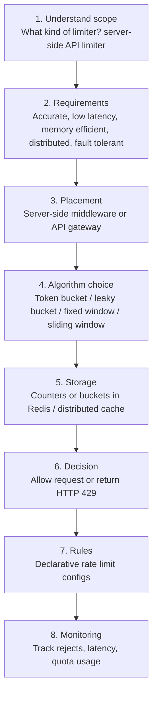

# Design a Rate Limiter 复习笔记

这组笔记整理自截图内容，主题是设计 API Rate Limiter。笔记按面试回答流程拆分：先确认问题范围和需求，再给出高层设计，然后深入限流算法，最后补充规则配置和分布式实现细节。

## 笔记目录

1. [问题背景、收益与需求](01-problem-scope-and-requirements.md)
2. [限流器放在哪里与高层设计](02-placement-and-high-level-design.md)
3. [限流算法详解](03-rate-limiting-algorithms.md)
4. [规则配置、深挖设计与面试总结](04-rules-deep-dive-and-summary.md)

## 总体思路

## 一句话总览

Rate limiter 的核心是控制某个主体在某段时间内能发多少请求。设计时要明确限流对象、限流维度、限流算法、限流状态存储、分布式一致性、异常处理和被限流后的响应方式。
