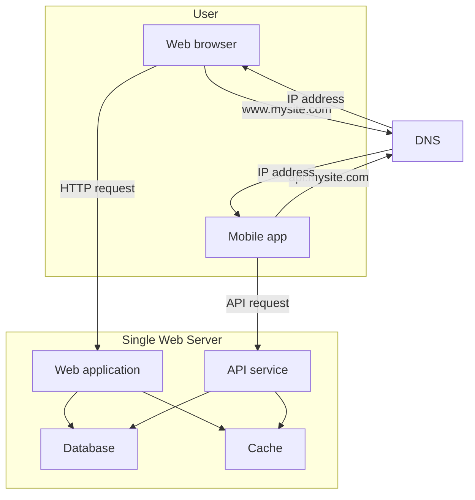
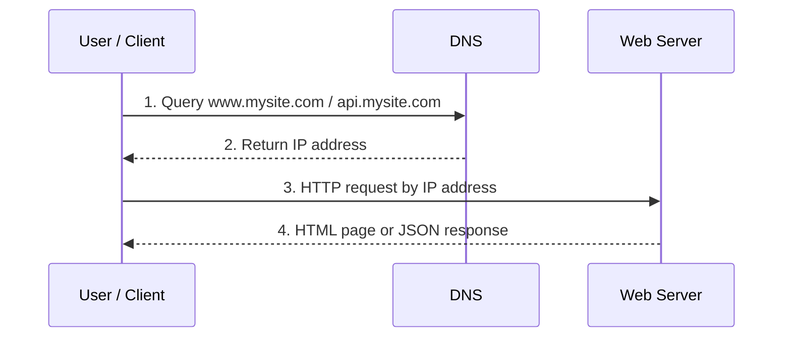

# 01. 单服务器架构与请求流程

## 1. 单服务器架构 Single Server Setup

系统最开始可以非常简单：所有组件都运行在一台服务器上。

这台服务器可能同时承担：

- Web 应用
- API 服务
- 数据库
- 缓存
- 静态文件服务
- 业务逻辑处理

这种架构适合：

- 原型项目
- 早期产品
- 流量很小的网站
- 学习或面试中解释系统演进的起点

它的最大优点是简单，部署和调试都很容易。它的最大问题是没有扩展性和容错能力：一台机器既处理请求，又读写数据库，一旦 CPU、内存、磁盘、网络或数据库成为瓶颈，整个系统都会变慢。

## 2. 图 1-1：单服务器架构还原



图中体现了一个关键点：用户看起来访问的是域名，但真正通信时客户端需要先拿到服务器 IP 地址。

## 3. 用户访问网站的请求流程

截图中书里把请求流程拆成几步：

1. 用户通过域名访问网站，例如 `www.mysite.com` 或 `api.mysite.com`。
2. 浏览器或移动 App 请求 DNS，查询域名对应的 IP 地址。
3. DNS 返回 IP 地址，例如 `15.125.23.214`。
4. 客户端用这个 IP 地址向 Web Server 发起 HTTP 请求。
5. Web Server 返回 HTML 页面或 JSON 响应。

## 4. 图 1-2：DNS + HTTP 请求流程还原



## 5. Web App 与 Mobile App 的区别

截图里提到，访问系统的流量通常来自两类客户端：

- Web application
- Mobile application

Web application 通常返回 HTML 页面，也可能加载 CSS、JavaScript 和图片。服务器端可以用 Java、Python、Go、Node.js 等语言实现业务逻辑。

Mobile application 通常调用 API，服务器返回 JSON。移动端拿到 JSON 后，在 App 内渲染 UI。

## 6. JSON API 示例

移动端 API 常见返回格式是 JSON：

```json
{
  "id": 12,
  "firstName": "John",
  "lastName": "Smith",
  "address": {
    "streetAddress": "21 2nd Street",
    "city": "New York",
    "state": "NY",
    "postalCode": 10021
  },
  "phoneNumbers": [
    "212 555-1234",
    "646 555-4567"
  ]
}
```

JSON 的优点是结构清晰、体积相对较小，并且几乎所有编程语言都支持解析。

## 7. 单服务器架构的瓶颈

单服务器系统会遇到这些问题：

- 所有服务共享同一台机器资源。
- Web 服务和数据库会互相抢 CPU、内存、磁盘 IO。
- 数据库变慢会拖慢整个应用。
- 服务器宕机后，网站完全不可用。
- 无法独立扩展 Web 层和数据库层。
- 静态资源、动态请求和数据库请求都集中在一个地方。

## 8. 面试复习点

- DNS 的作用是把域名解析成 IP 地址。
- 浏览器访问网页通常返回 HTML，移动 App 调 API 通常返回 JSON。
- 单服务器架构简单，但存在单点故障。
- 单服务器无法独立扩展 Web 服务和数据库。
- 系统扩展的第一步通常是拆分 Web Server 和 Database。
