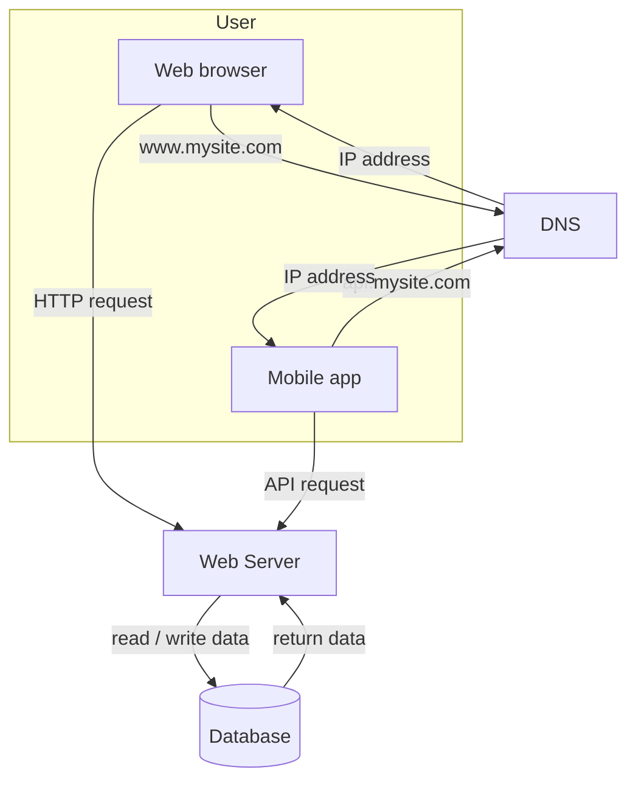

# 02. 数据库拆分、数据库选择与扩展方式

## 1. 为什么要把数据库拆出来

当用户量增长时，一台服务器同时运行 Web 应用和数据库会不够用。此时可以把 Web Server 和 Database Server 分开。

拆分后：

- Web Server 专注处理请求和业务逻辑。
- Database Server 专注存储和查询数据。
- 两层可以独立扩展。
- 数据库可以放在更适合存储和 IO 的机器上。
- Web Server 可以放在更适合计算和网络吞吐的机器上。

## 2. 图 1-3：Web Server 与 Database 分离

这个架构比单机更好，因为 Web 层和数据库层职责分离，后面可以继续加入负载均衡、缓存和数据库复制。

## 3. 选择哪种数据库

截图中把数据库分为两大类：

- Relational Database，关系型数据库，也叫 RDBMS 或 SQL Database。
- Non-relational Database，非关系型数据库，也叫 NoSQL Database。

选择数据库时不要只看哪种技术流行，而要看数据模型和访问模式。

## 4. 关系型数据库

关系型数据库把数据组织为表、行和列，使用 SQL 查询。

常见关系型数据库：

- MySQL
- PostgreSQL
- Oracle

适合场景：

- 数据结构稳定。
- 需要事务。
- 需要复杂查询。
- 需要 join。
- 强一致性要求较高。

例子：

- 用户账户系统
- 支付系统
- 订单系统
- 库存系统

优点：

- 数据模型清晰。
- SQL 表达能力强。
- 事务支持成熟。
- 适合复杂业务关系。

缺点：

- 水平扩展更复杂。
- 超大规模写入和海量数据存储时可能需要分库分表。

## 5. 非关系型数据库 NoSQL

截图中提到的 NoSQL 类型包括：

- Key-value store
- Graph store
- Column store
- Document store

常见 NoSQL 数据库：

- CouchDB
- Neo4j
- Cassandra
- HBase
- Amazon DynamoDB

适合场景：

- 需要超低延迟。
- 数据结构不固定。
- 只需要序列化和反序列化数据。
- 不需要复杂 join。
- 数据量非常大。

截图中提到，当满足下面情况时，NoSQL 可能是合适选择：

- 应用需要 super-low latency。
- 数据是 unstructured，或者没有关系型数据。
- 只需要 serialize / deserialize 数据，例如 JSON、XML、YAML。
- 需要存储 massive amount of data。

## 6. SQL vs NoSQL 选择口诀

可以这样记：

- 关系复杂、事务重要、数据结构稳定：SQL。
- 数据巨大、访问模式简单、结构灵活、低延迟：NoSQL。

面试时不要说“我直接用某某数据库”，而应该先说访问模式：

- 数据如何写？
- 数据如何读？
- 是否需要事务？
- 是否需要 join？
- 是否需要强一致？
- 数据规模多大？
- 是否需要水平扩展？

## 7. 垂直扩展 Vertical Scaling

垂直扩展也叫 scale up，意思是增强单台服务器能力。

方式包括：

- 增加 CPU。
- 增加内存。
- 增加磁盘容量。
- 使用更快磁盘。
- 提升网络能力。

优点：

- 简单。
- 对系统架构改动少。
- 适合早期系统。

缺点：

- 有硬件上限。
- 成本可能越来越高。
- 仍然有单点故障。
- 一台机器挂掉，服务还是不可用。
- 不适合大规模系统。

## 8. 水平扩展 Horizontal Scaling

水平扩展也叫 scale out，意思是增加更多服务器。

方式包括：

- 增加更多 Web Server。
- 增加更多缓存节点。
- 增加更多数据库副本。
- 分片或分区数据。

优点：

- 更适合大型系统。
- 可以逐步扩容。
- 更容易做高可用。
- 单台机器故障影响较小。

缺点：

- 架构复杂度上升。
- 需要负载均衡。
- 需要处理状态、会话、缓存一致性和数据一致性。

## 9. 垂直扩展 vs 水平扩展对比

| 对比项 | 垂直扩展 Scale up | 水平扩展 Scale out |
|---|---|---|
| 做法 | 升级单台机器 | 增加多台机器 |
| 难度 | 简单 | 更复杂 |
| 上限 | 有明显硬件上限 | 理论上更容易继续扩展 |
| 容错 | 单点故障仍存在 | 可以通过多副本提升容错 |
| 成本 | 高端机器越来越贵 | 可使用普通机器扩展 |
| 适合阶段 | 早期、低流量 | 中后期、大规模 |

## 10. 面试复习点

- 数据库拆分是从单机走向可扩展架构的重要一步。
- 关系型数据库适合事务、join、结构化数据和复杂查询。
- NoSQL 适合低延迟、非结构化数据、大规模数据和简单访问模式。
- 垂直扩展简单但有上限，也不能解决单点故障。
- 水平扩展更适合大规模系统，但需要额外组件和架构设计。
