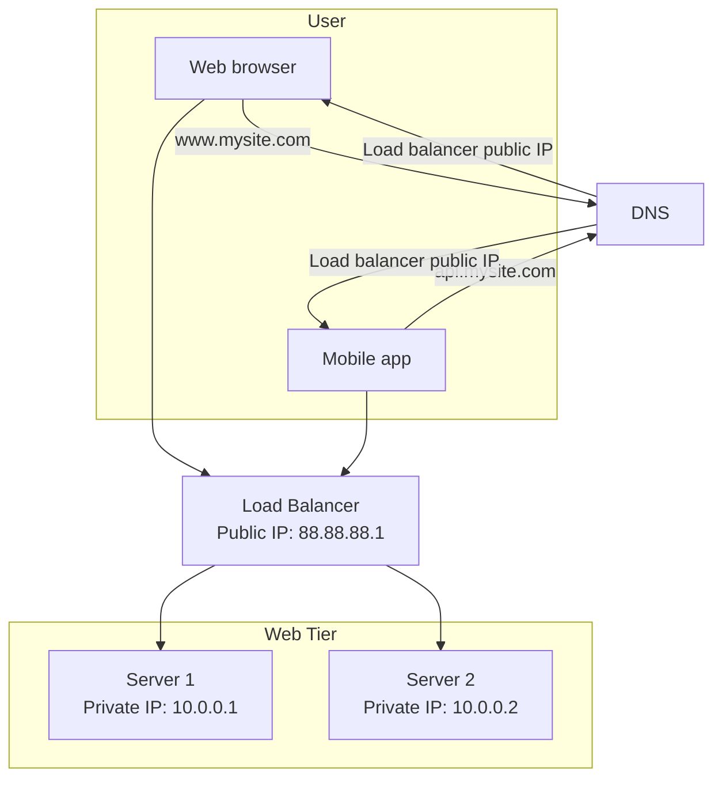
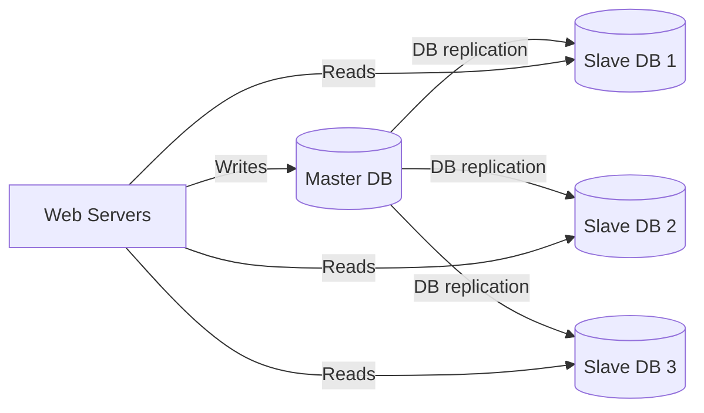
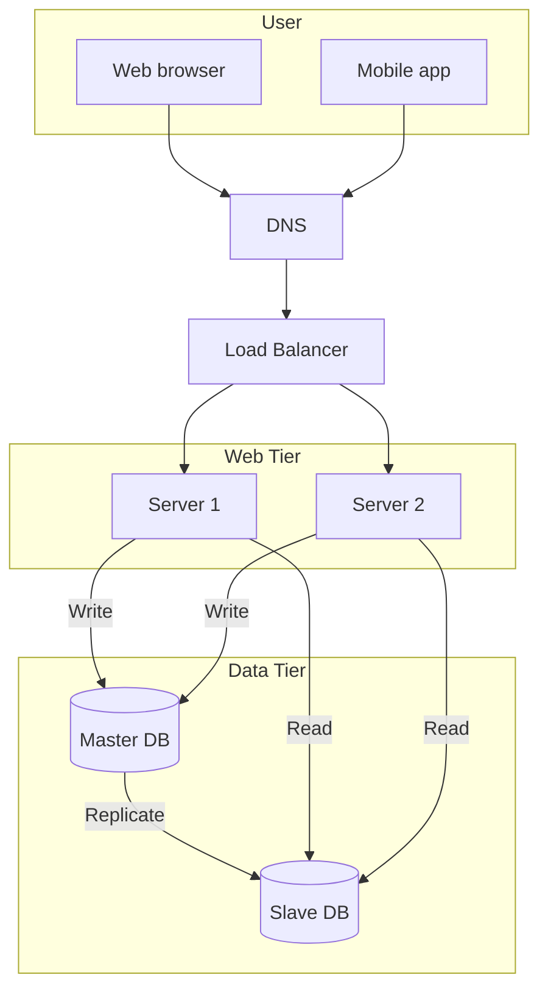

# 03. 负载均衡与数据库复制

## 1. 为什么需要负载均衡

当 Web Server 不止一台时，用户请求需要被分发到不同服务器。负载均衡器就是负责分发流量的组件。

负载均衡解决的问题：

- 单台 Web Server 过载。
- 单台 Web Server 宕机导致服务不可用。
- 无法灵活增加服务器。
- 用户请求无法自动分配到健康节点。

加入负载均衡后，客户端不再直接访问 Web Server，而是访问 Load Balancer。

## 2. 图 1-4：负载均衡架构还原

图里的关键点：

- 负载均衡器有公网 IP。
- 后端 Web Server 使用私网 IP。
- 用户无法直接访问 Web Server。
- 负载均衡器通过私网把请求转发给 Web Server。

## 3. Public IP 和 Private IP

Public IP：

- 公网上可访问。
- 用户可以通过互联网访问。
- 通常暴露给外部客户端。

Private IP：

- 只在内网中可访问。
- 互联网用户无法直接访问。
- 常用于服务器之间通信。

这样设计的好处是安全性更好：外部用户只能访问 Load Balancer，不能直接打到后端服务器。

## 4. 负载均衡带来的能力

如果 Server 1 宕机：

- Load Balancer 停止把流量发给 Server 1。
- 流量被转发到 Server 2。
- 网站仍然可以工作。

如果流量增长：

- 添加 Server 3、Server 4。
- Load Balancer 自动把流量分发给新服务器。

因此，负载均衡提升了：

- 可用性
- 扩展性
- 故障隔离能力
- 请求分发能力

## 5. 为什么还需要数据库复制

有了多个 Web Server 后，Web 层可以扩展，但数据库仍然可能成为瓶颈。

数据库瓶颈包括：

- 读请求太多。
- 写请求集中。
- 单数据库宕机导致服务不可用。
- 数据没有冗余备份。

数据库复制通过多个数据库副本解决这些问题。

## 6. 图 1-5：数据库复制架构还原

常见模型是 master-slave，也可以叫 primary-replica：

- Master DB：处理写操作。
- Slave DB：复制主库数据，处理读操作。

## 7. 数据库复制的优点

截图中提到数据库复制的两个主要优点：

### 7.1 Better performance

在主从模型中：

- 写操作进入主库。
- 读操作分散到从库。

大多数应用读多写少，所以把读请求分散到多个从库可以提升整体性能。

### 7.2 Reliability

数据被复制到多个数据库节点。即使一个数据库节点损坏，数据仍然保存在其他节点。

如果数据库分布在不同位置，还能减少某个机房故障带来的风险。

## 8. 数据库故障场景

### 8.1 一个从库宕机

如果只有一个从库：

- 读请求可以暂时发到主库。
- 系统创建新的从库替代旧从库。

如果有多个从库：

- 读请求转发到其他健康从库。
- 宕机从库恢复或被新从库替代。

### 8.2 主库宕机

主库宕机时：

- 一个从库会被提升为新的主库。
- 写请求切换到新主库。
- 系统补充新的从库。

生产环境中主从切换更复杂，因为：

- 从库可能落后于主库。
- 复制存在延迟。
- 新主库可能缺少部分最新数据。
- 需要补齐数据或处理冲突。

## 9. 图 1-6：负载均衡 + 数据库复制

## 10. 加入负载均衡和复制后的请求流程

截图中对应的流程可以整理为：

1. 用户从 DNS 获取 Load Balancer 的 IP。
2. 用户连接 Load Balancer。
3. HTTP 请求被转发到 Server 1 或 Server 2。
4. Web Server 从 Slave Database 读取数据。
5. Web Server 把写入、更新、删除请求发送到 Master Database。
6. Master Database 把数据变化复制到 Slave Database。

## 11. 面试复习点

- Load Balancer 让 Web 层可以水平扩展。
- Public IP 暴露给用户，Private IP 用于内网通信。
- 用户不应该直接访问后端 Web Server。
- 主从复制中，主库负责写，从库负责读。
- 数据库复制提升读性能、可靠性和可用性。
- 主从切换时要考虑复制延迟和数据一致性。
