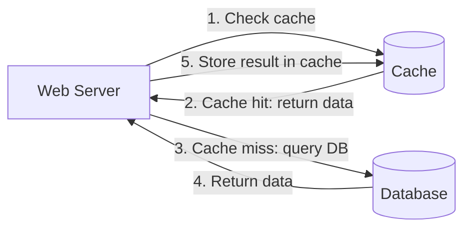
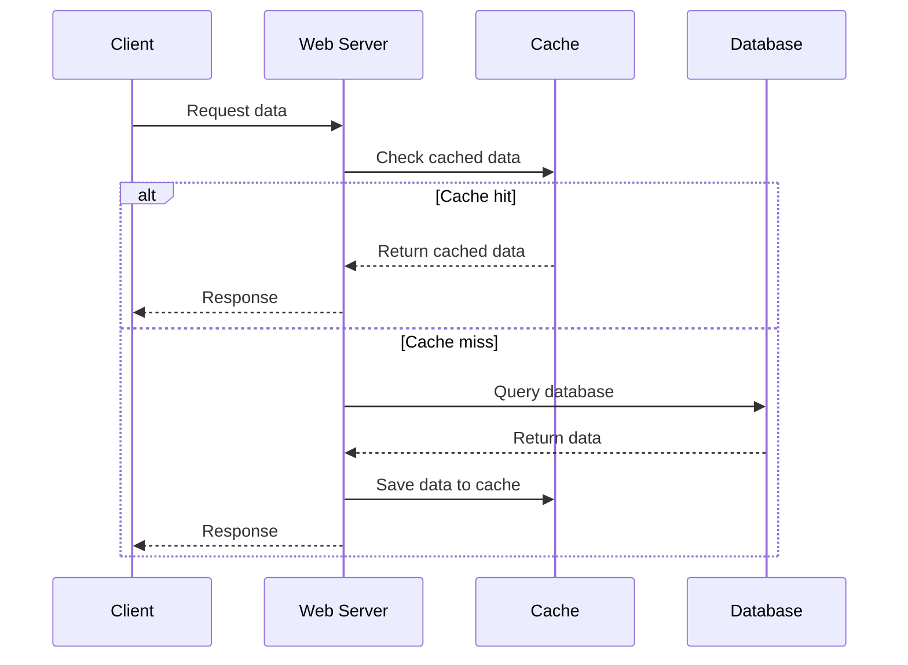
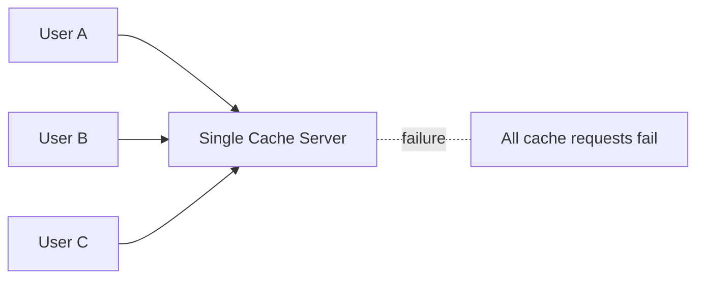

# 04. 缓存 Cache

## 1. 为什么需要缓存

当用户越来越多时，仅靠数据库处理所有读请求会很慢，也会给数据库带来巨大压力。缓存是一个临时数据存储层，通常基于内存，因此访问速度比数据库快很多。

缓存的目标：

- 降低响应时间。
- 减少数据库负载。
- 缓存昂贵查询结果。
- 缓存频繁访问的数据。

截图中的核心观点是：应用性能很大程度上受数据库调用影响，而缓存可以缓解这个问题。

## 2. 缓存层 Cache Tier

缓存层位于 Web Server 和 Database 之间。

## 3. 图 1-7：缓存读取流程还原

截图中的流程可以整理为：

1. Web Server 收到请求。
2. 先检查缓存是否有需要的数据。
3. 如果缓存有，直接把数据返回给客户端。
4. 如果缓存没有，Web Server 查询数据库。
5. 数据库把结果返回给 Web Server。
6. Web Server 把结果写入缓存。
7. 后续请求直接从缓存返回。

这种模式常叫 cache-aside，也就是应用代码先查缓存，缓存没有再查数据库。

## 4. 什么时候适合使用缓存

适合缓存：

- 读多写少的数据。
- 重复访问频繁的数据。
- 查询成本高的数据。
- 可以接受短暂不一致的数据。
- 用户资料、商品详情、配置、排行榜、推荐结果等。

不适合缓存：

- 更新非常频繁的数据。
- 强一致性要求极高的数据。
- 几乎不会重复访问的数据。
- 每次请求结果都不同的数据。

## 5. 缓存过期 Expiration Policy

截图中强调了 expiration policy：缓存数据需要设置过期时间。

为什么需要过期时间：

- 避免旧数据永久留在缓存里。
- 避免缓存无限增长。
- 让数据最终能从数据库刷新。

TTL 太短：

- 缓存频繁失效。
- 请求更多地打到数据库。
- 缓存效果下降。

TTL 太长：

- 数据可能过旧。
- 用户看到 stale data。
- 数据一致性更差。

因此，TTL 要根据业务场景决定。

## 6. 缓存一致性 Consistency

缓存一致性指数据库和缓存中的数据是否一致。

问题来源：

- 数据库更新了，缓存没有更新。
- 缓存还保存旧值。
- 多个地区或多个缓存节点之间状态不同。

常见处理方式：

- 更新数据库后删除缓存。
- 更新数据库后更新缓存。
- 设置合理 TTL，让旧数据自动过期。
- 对强一致数据不使用缓存或缩短缓存时间。

面试里可以说：缓存通常引入最终一致性，适合允许短暂不一致的读路径。

## 7. 缓存故障和单点问题

截图里用 single cache server 说明：单个缓存服务器可能成为 single point of failure。

如果只有一个缓存节点：

- 它挂掉后，所有请求都打到数据库。
- 数据库可能被突然压垮。
- 缓存层本身成为系统风险点。

解决思路：

- 使用多个缓存节点。
- 对缓存做集群化。
- 客户端或服务端支持缓存故障降级。
- 保护数据库，避免缓存故障导致数据库雪崩。

## 8. 缓存淘汰 Eviction Policy

缓存空间有限，满了以后需要删除一些数据。

常见策略：

- LRU：Least Recently Used，淘汰最近最少使用的数据。
- LFU：Least Frequently Used，淘汰使用频率最低的数据。
- FIFO：First In First Out，淘汰最早进入缓存的数据。

什么时候用哪种：

- 热点随时间变化明显：LRU 常见。
- 访问频率更重要：LFU 可考虑。
- 简单队列式缓存：FIFO 简单但不一定最优。

## 9. 常见缓存问题

### 9.1 缓存穿透

请求的数据不存在，缓存也没有，每次都打到数据库。

解决：

- 缓存空值。
- Bloom Filter。
- 参数校验，拦截非法请求。

### 9.2 缓存击穿

某个热点 key 过期，大量请求同时打到数据库。

解决：

- 热点 key 永不过期或后台刷新。
- 加互斥锁，只允许一个请求回源。
- 提前异步刷新。

### 9.3 缓存雪崩

大量 key 同时过期，数据库瞬间压力暴增。

解决：

- TTL 加随机抖动。
- 分批过期。
- 多级缓存。
- 数据库限流和降级。

## 10. 面试复习点

- 缓存适合读多写少、可接受短暂不一致的数据。
- Cache-aside 是常见模式：先读缓存，miss 后读数据库，再写缓存。
- 缓存需要 TTL，否则旧数据可能长期存在。
- 缓存会引入一致性问题。
- 单缓存节点可能成为 SPOF。
- 缓存淘汰策略常见 LRU、LFU、FIFO。
- 缓存穿透、击穿、雪崩是面试高频点。
