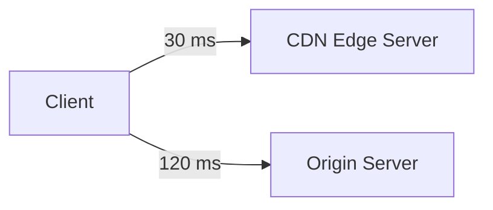
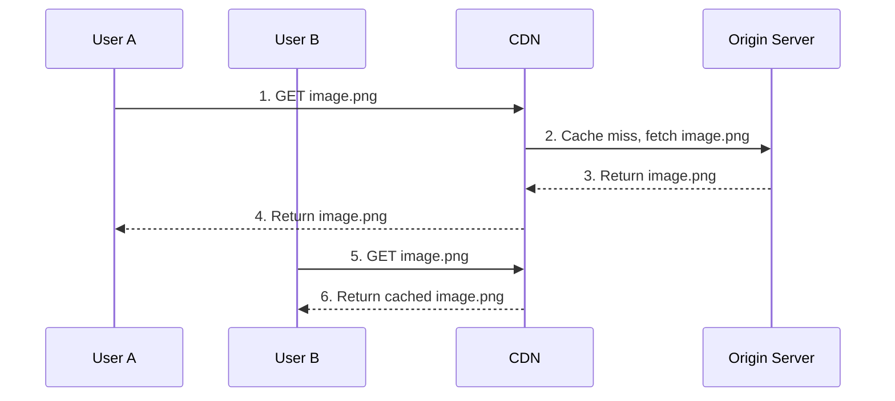
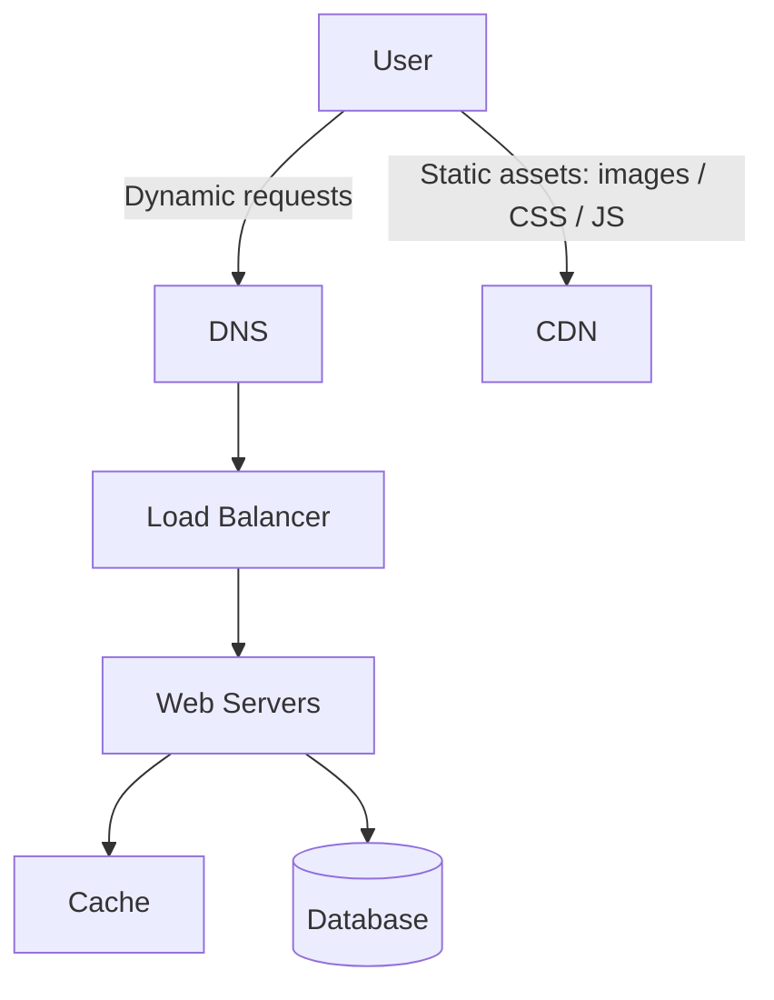
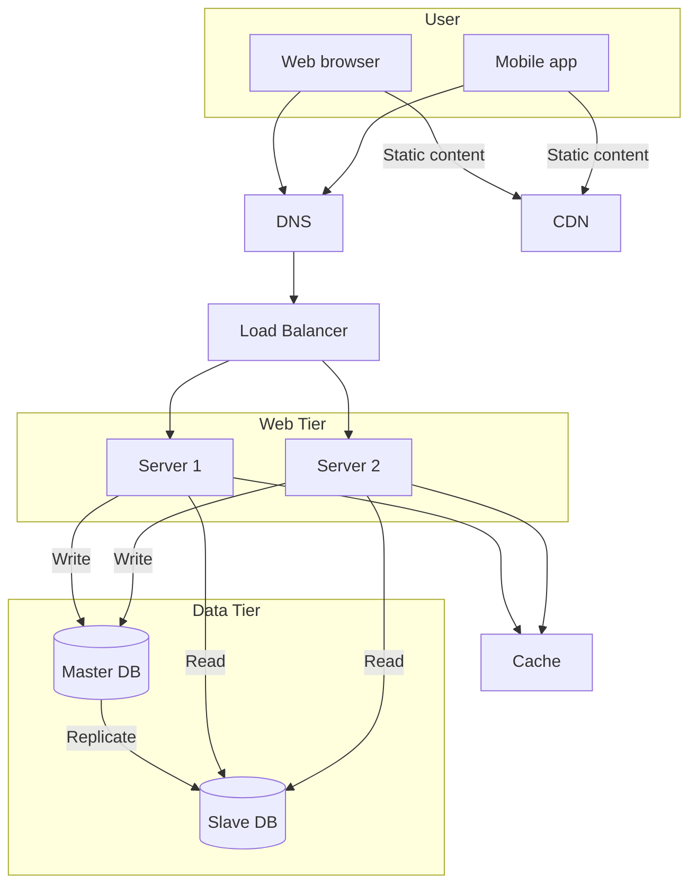

# 05. CDN 内容分发网络

## 1. CDN 是什么

CDN，全称 Content Delivery Network，是一组分布在不同地理位置的服务器，用来分发静态内容。

常见静态内容：

- 图片
- 视频
- CSS
- JavaScript
- 字体文件
- 静态 HTML

CDN 的核心目标是：把内容缓存到离用户更近的位置，让用户更快获取资源，同时减少源站压力。

## 2. 为什么需要 CDN

如果所有用户都从同一个源站下载图片或视频：

- 远距离用户延迟高。
- 源站带宽压力大。
- 静态资源会占用 Web Server 资源。
- 热点图片或视频可能拖慢动态请求。

CDN 把静态资源缓存到边缘节点，用户从最近的节点读取资源，体验更好。

## 3. 图 1-9：CDN 改善延迟

截图里展示了用户访问 CDN 比访问 origin 更快的情况。



这个图想表达：如果用户离 CDN 节点更近，请求静态资源时会更快。

## 4. 图 1-10：CDN 工作流程还原

截图中的步骤可以整理为：

1. User A 请求图片，例如 `image.png`。
2. CDN 检查自己是否有缓存。
3. 如果 CDN 没有缓存，就从 origin server 拉取图片。
4. Origin server 返回图片给 CDN。
5. CDN 缓存图片，并返回给 User A。
6. User B 再请求同一张图片时，CDN 直接返回缓存。



## 5. 加入 CDN 后的系统位置

CDN 通常服务静态资源；动态 API 请求仍然进入 Web Server。



## 6. CDN 使用注意事项

### 6.1 Cost 成本

CDN 通常按流量收费。如果图片、视频访问量很大，成本会明显增加。

### 6.2 适合缓存静态内容

适合放 CDN：

- 图片
- 视频
- CSS
- JavaScript
- 不经常变化的文件

不适合放 CDN：

- 强个性化动态 API。
- 每个用户都不同的私密数据。
- 需要强一致实时更新的数据。

### 6.3 Cache Expiry 缓存过期

CDN 内容需要设置过期时间。

TTL 太短：

- CDN 经常回源。
- 源站压力变大。
- CDN 效果变差。

TTL 太长：

- 用户可能看到旧图片、旧 JS、旧 CSS。
- 内容更新不及时。

### 6.4 CDN Fallback

如果 CDN 临时不可用，系统应该能回源。

例如：

- 用户请求 CDN 失败。
- 客户端或服务端回退到 origin。
- 监控 CDN 错误率并告警。

### 6.5 Object Versioning

如果文件更新，但 CDN 缓存还没过期，可以用版本化文件名。

例子：

```text
image.png?v=2
app.9f3a1c.js
style.20260629.css
```

版本号或 hash 改变后，CDN 会把它当作新资源拉取。

## 7. 图 1-11：加入 CDN 和缓存后的架构



## 8. 面试复习点

- CDN 用来分发静态内容，不是用来替代数据库或业务服务。
- CDN 能降低延迟，也能减轻源站压力。
- CDN miss 时会回源，hit 时直接从边缘节点返回。
- CDN 要考虑成本、TTL、失效、回源和版本化。
- 图片、视频、CSS、JS 应该优先走 CDN。
