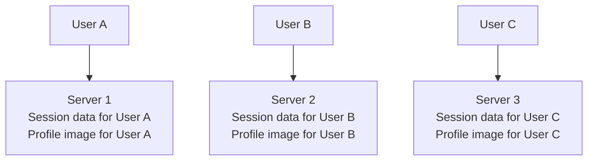
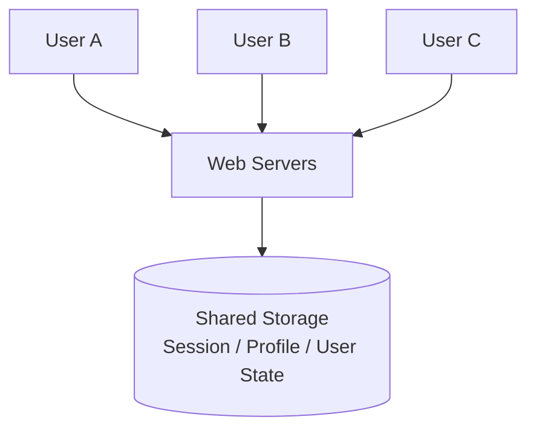
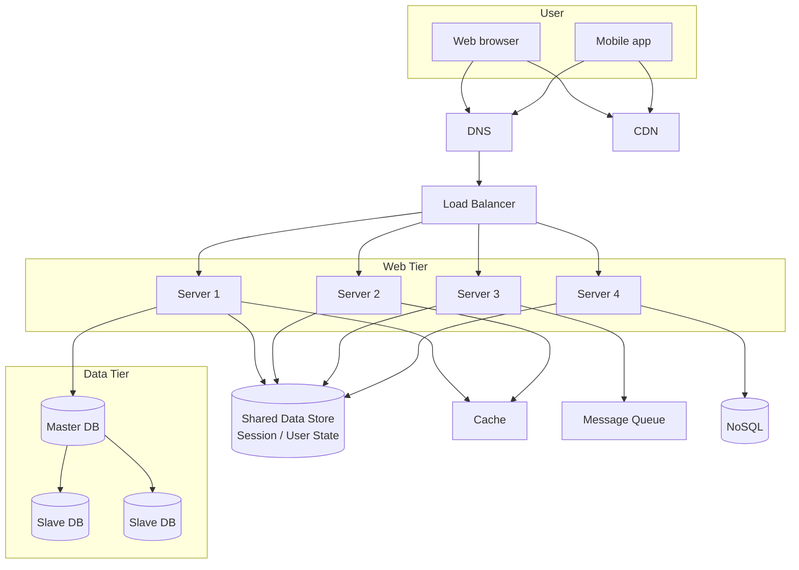

# 06. 无状态 Web 层

## 1. 为什么 Web 层要无状态

当系统有多台 Web Server 时，如果用户状态保存在某一台服务器上，请求就必须回到同一台服务器，否则服务器找不到用户状态。

这种设计叫 stateful architecture，有状态架构。

问题：

- 用户 A 的 session 在 Server 1。
- 用户 A 下一次请求如果到了 Server 2，Server 2 没有 session。
- 负载均衡器需要 sticky session，把用户固定到某台服务器。
- Server 1 宕机时，用户状态丢失。
- 扩容和故障切换都更复杂。

无状态 Web 层的核心思想是：Web Server 不保存用户状态，用户状态放到共享存储中。

## 2. 图 1-12：有状态架构 Stateful Architecture

截图中的例子：

- User A 的 session 和 profile image 在 Server 1。
- User B 的 session 和 profile image 在 Server 2。
- User C 的 session 和 profile image 在 Server 3。

这种架构的问题是：用户请求必须被路由回保存其状态的服务器。

## 3. 有状态架构的具体问题

截图文字举例：

- User A session data and profile image are stored in Server 1。
- 如果 User A 的 HTTP request 被路由到 Server 2，Server 2 没有 User A 的状态。
- 请求会失败，除非所有请求都固定打到 Server 1。

这就是 sticky session。

Sticky session 的缺点：

- 负载均衡不够灵活。
- 某台机器可能因为绑定用户太多而过载。
- 机器故障时用户状态丢失。
- 自动扩缩容困难。

## 4. 图 1-13：无状态架构 Stateless Architecture

无状态架构把 session、profile image 等状态从 Web Server 移出去，放到共享存储中。

这样任意 Web Server 都可以处理任意用户请求。

## 5. Stateless 的含义

Stateless 并不是系统没有状态，而是 Web Server 本身不保存状态。

状态可以保存到：

- Redis
- Memcached
- Database
- Object storage
- Distributed session store

Web Server 只负责：

- 接收请求。
- 校验 token。
- 处理业务逻辑。
- 从共享存储读取状态。
- 返回响应。

## 6. 图 1-14：更新后的无状态 Web 层设计

截图中无状态架构被放回完整系统中：

## 7. 无状态 Web 层的好处

- 任意服务器都可以处理任意请求。
- 负载均衡更简单。
- 水平扩展更容易。
- 自动扩缩容更容易。
- 单台 Web Server 宕机影响更小。
- 发布和重启服务更安全。

## 8. 无状态 Web 层的代价

无状态 Web 层也不是完全没有代价：

- 需要额外的共享存储。
- 共享存储自身要高可用。
- 每次请求可能需要读取 session store。
- 如果共享存储变慢，所有 Web Server 都受影响。
- 需要设计 token/session 过期策略。

## 9. 面试复习点

- Stateful Web Server 会让用户请求绑定到特定服务器。
- Sticky session 会降低负载均衡和容灾能力。
- Stateless Web Tier 把状态放到共享存储。
- Web Server 无状态后更容易水平扩展。
- 无状态不是没有状态，而是状态不保存在 Web Server 本地。
