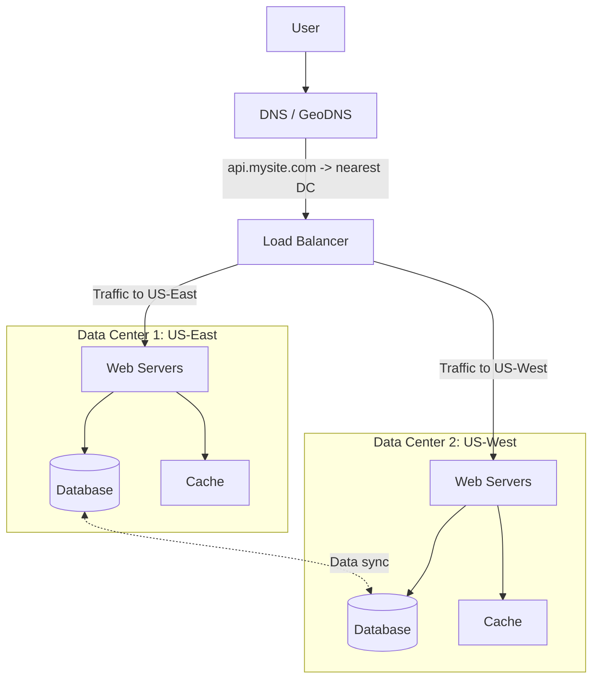
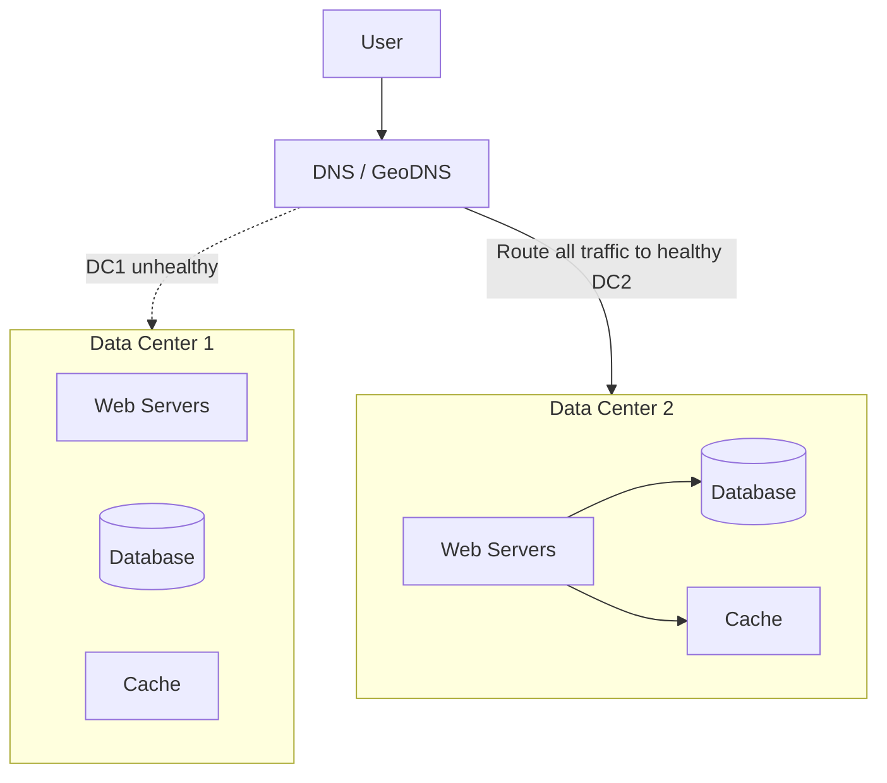
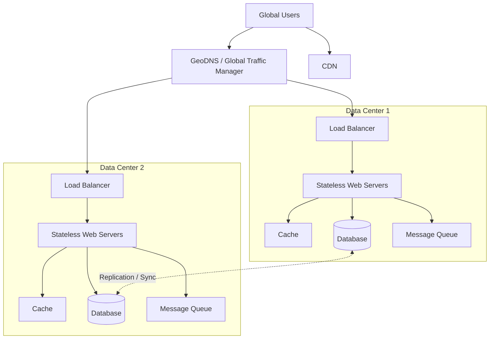

# 07. 数据中心 Data Centers

## 1. 为什么需要多个数据中心

当用户分布在多个地理区域时，单个数据中心会遇到两个问题：

- 距离远的用户访问延迟高。
- 单个数据中心故障会导致服务不可用。

多个数据中心可以让用户访问离自己更近的数据中心，也能在某个数据中心故障时把流量切到其他数据中心。

## 2. 图 1-15：两个数据中心架构

截图中例子：

- Normal operation 下，用户流量可以按地理位置分到不同数据中心。
- `geoDNS` 根据用户位置把域名解析到合适的数据中心 IP。
- 例如美国东部用户访问 `us-east-1`，美国西部用户访问 `us-west-1`。

## 3. GeoDNS 的作用

GeoDNS 会根据用户地理位置返回不同 IP。

例子：

- 美国东部用户：返回 US-East 数据中心 IP。
- 美国西部用户：返回 US-West 数据中心 IP。
- 欧洲用户：返回欧洲数据中心 IP。

这样做的好处：

- 用户离服务更近。
- 网络延迟更低。
- 可以根据地域分摊流量。

## 4. 图 1-16：数据中心故障切换

截图中提到：如果一个数据中心宕机，流量会被路由到健康的数据中心。

如果 Data Center 1 出问题，GeoDNS 或流量调度系统会把流量切到 Data Center 2。

## 5. 多数据中心的好处

- 降低用户访问延迟。
- 提升系统可用性。
- 一个数据中心故障时可以切流。
- 支持全球用户。
- 可以做灾备和容灾。

## 6. 多数据中心的挑战

截图里提到 several technical challenges must be resolved。

### 6.1 Traffic Redirection

需要有效工具把流量导向正确的数据中心。

常见方式：

- GeoDNS
- Anycast
- Global Load Balancer
- Traffic Manager

难点：

- DNS 有缓存，切流不是瞬间完成。
- 不同用户和网络运营商看到的 DNS 结果可能不同。
- 健康检查要准确。

### 6.2 Data Synchronization

不同数据中心之间需要同步数据。

问题：

- 用户在 Data Center 1 写入数据。
- 下一次请求被路由到 Data Center 2。
- 如果数据还没同步，用户可能读不到刚写入的数据。

解决思路：

- 异步复制。
- 同步复制。
- 按用户归属地路由。
- 冲突检测和解决。
- 最终一致性。

### 6.3 Test and Deployment

多数据中心让测试和部署更复杂。

需要确认：

- 服务在每个数据中心都能运行。
- 配置一致。
- 数据库连接正确。
- 缓存、队列、存储都可用。
- 新版本发布不会只影响某个数据中心。

### 6.4 Consistency

跨数据中心一致性通常比单数据中心更难。

原因：

- 跨地域网络延迟高。
- 数据复制可能延迟。
- 多地同时写入可能冲突。

面试中可以说：多数据中心通常会在一致性、延迟和可用性之间做取舍。

## 7. 多数据中心后的完整架构

## 8. 面试复习点

- 多数据中心用于降低延迟和提升容灾能力。
- GeoDNS 可以按用户位置返回不同数据中心 IP。
- 一个数据中心故障时，流量应切到健康数据中心。
- 多数据中心最大难点是数据同步和一致性。
- DNS 缓存会影响切流速度。
- 多数据中心部署要特别注意配置、测试和监控。
