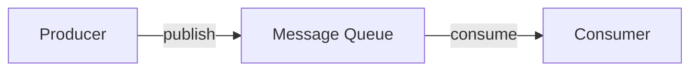
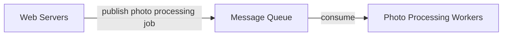

# 08. 消息队列 Message Queue

## 1. 为什么需要消息队列

随着系统功能变多，很多任务不需要在用户请求路径里同步完成。比如上传照片后，系统可能还要做图片压缩、生成缩略图、内容审核、通知好友、更新搜索索引等。如果这些任务都在请求里同步完成，用户会等待很久，系统也更容易被慢任务拖垮。

消息队列的作用是把生产者和消费者解耦，让任务异步执行。

核心思想：

- Producer 负责把消息发布到队列。
- Message Queue 负责暂存消息。
- Consumer 负责从队列取消息并处理。

消息队列是 durable component，通常保存在内存或磁盘中，支持异步通信。

## 2. 图 1-17：消息队列模型还原

这张图表达了最基本的消息队列模型：生产者和消费者不直接通信，而是通过队列传递任务。

## 3. 生产者 Producer

Producer 也叫 publisher，负责把消息写入队列。

常见生产者：

- Web Server
- API Service
- Upload Service
- Order Service
- User Service

例子：

- 用户上传照片后，Web Server 发布一条 `PhotoUploaded` 消息。
- 用户下单后，Order Service 发布一条 `OrderCreated` 消息。
- 用户注册后，User Service 发布一条 `UserRegistered` 消息。

## 4. 消费者 Consumer

Consumer 也叫 subscriber，负责从队列取消息并执行任务。

常见消费者：

- 图片处理 worker
- 邮件通知 worker
- 搜索索引 worker
- 推荐系统 worker
- 数据分析 worker

消费者可以在生产者不可用时继续处理队列中已有消息；生产者也可以在消费者暂时不可用时继续发布消息。只要队列还可用，系统就不会因为某个下游服务慢而立即崩掉。

## 5. 解耦 Decoupling

截图中强调：Decoupling makes the message queue a preferred architecture for building scalable and reliable applications。

解耦的好处：

- Producer 不需要知道 Consumer 的位置和实现。
- Consumer 变慢不会直接阻塞用户请求。
- 可以独立扩展消费者数量。
- 某个消费者服务故障时，消息可以暂存在队列里。
- 不同服务之间依赖更少。

## 6. 图 1-18：照片处理任务还原

截图中举了照片处理的例子：

1. Web Server 接收照片上传请求。
2. Web Server 把照片处理任务发布到 message queue。
3. Photo processing worker 从队列中取任务。
4. Worker 执行裁剪、压缩、滤镜、缩略图等处理。

如果队列里有很多任务，可以增加更多 workers；如果队列为空，可以减少 workers。

## 7. 为什么消息队列提升可扩展性

消息队列让系统可以按任务类型扩展：

- 上传服务只负责接收请求和发布消息。
- 图片处理 worker 独立扩展。
- 邮件 worker 独立扩展。
- 搜索索引 worker 独立扩展。

如果图片处理很慢，不会直接拖慢上传接口；如果某段时间上传量暴增，队列可以先积压任务，消费者慢慢处理。

## 8. 消息队列适合的场景

适合使用消息队列：

- 异步任务
- 削峰填谷
- 事件驱动架构
- 后台任务
- 日志处理
- 图片、视频处理
- 通知、邮件、短信发送
- 搜索索引更新
- 数据分析 pipeline

不适合使用消息队列：

- 必须同步返回结果的请求。
- 强一致事务的一部分，且无法接受最终一致。
- 任务必须立即完成，否则用户不能继续。

## 9. 消息队列设计注意点

### 9.1 消息持久化

队列需要保证消息不轻易丢失。重要消息应持久化到磁盘或复制到多个节点。

### 9.2 重试机制

消费者处理失败时，需要重试。但重试不能无限进行，否则会拖垮系统。

常见做法：

- 固定次数重试。
- 指数退避。
- 死信队列 Dead Letter Queue。

### 9.3 幂等性

消息可能被重复投递，所以 Consumer 必须尽量幂等。

例子：

- 同一条消息处理两次，不应该扣两次库存。
- 同一封通知不能无限重复发送。

### 9.4 顺序性

有些业务要求消息按顺序处理，例如同一个订单的状态变化。队列设计时要确认是否需要全局顺序或局部顺序。

### 9.5 积压监控

队列积压说明消费者处理速度跟不上生产速度。

需要监控：

- 队列长度。
- 消息延迟。
- 消费失败率。
- Consumer 数量。
- Dead letter 数量。

## 10. 面试复习点

- Message Queue 用于异步通信和服务解耦。
- Producer 发布消息，Consumer 消费消息。
- 队列可以缓冲任务，削峰填谷。
- 消费者可以独立水平扩展。
- 消息队列提升可靠性，但需要处理重试、幂等、顺序和死信队列。
- 图片处理、邮件通知、搜索索引更新都是典型队列场景。
