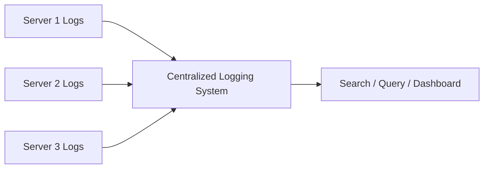
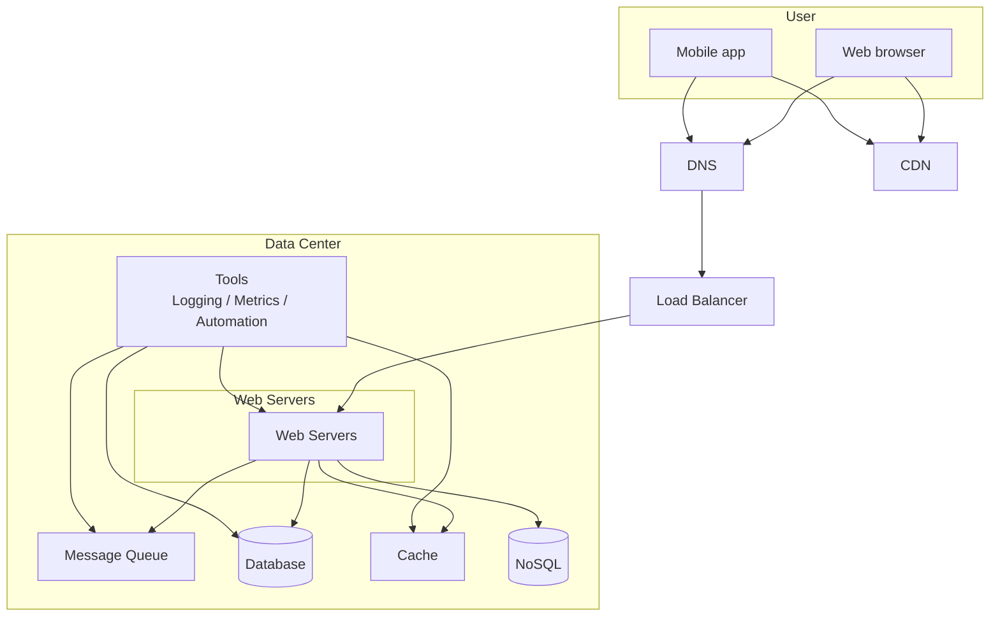

# 09. 日志、指标与自动化

## 1. 为什么需要日志、指标和自动化

当系统很小时，只有几台服务器，登录机器看日志也许还能工作。但当系统增长到大量服务器、多个服务、多个数据中心后，手动排查问题会非常低效。

截图中强调：当网站变成大业务后，investing in tools is essential。

需要建设：

- Logging
- Metrics
- Automation

它们的目标是让系统更可观测、更容易排查问题，并减少人工操作。

## 2. Logging 日志

日志用于记录系统运行过程中发生的事件。

常见日志：

- 请求日志
- 错误日志
- 业务日志
- 安全审计日志
- 慢查询日志
- 第三方调用日志

## 3. 为什么要集中化日志

如果每台服务器都有自己的日志文件，排查问题时需要逐台登录机器，很麻烦。

集中化日志的做法：

1. 每台服务器把日志发送到日志收集系统。
2. 日志系统统一存储和索引。
3. 工程师通过一个界面搜索和分析日志。

集中化日志的好处：

- 不用逐台登录服务器。
- 可以按 request id 或 trace id 搜索完整链路。
- 更容易发现错误模式。
- 更容易做告警和统计。

## 4. Metrics 指标

指标用于量化系统状态和业务状态。日志偏事件，指标偏趋势和聚合。

截图中提到的指标包括：

- Host level metrics：CPU、Memory、Disk I/O 等。
- Aggregated level metrics：例如整个 database tier 的性能。
- Key business metrics：daily active users、retention、revenue 等。

### 4.1 Host Level Metrics

主机级指标：

- CPU 使用率
- 内存使用率
- 磁盘使用率
- Disk I/O
- 网络吞吐
- Load average

这些指标帮助判断机器是否资源不足。

### 4.2 Aggregated Level Metrics

聚合级指标关注一组服务或一个系统层级。

例子：

- 整个 Web tier 的 QPS。
- 整个 database tier 的查询延迟。
- 缓存集群命中率。
- 队列整体积压长度。
- API 平均延迟和 P99 延迟。

### 4.3 Business Metrics

业务指标帮助理解产品健康状态。

例子：

- DAU
- Retention
- Revenue
- Sign-up count
- Order count
- Conversion rate

系统设计不仅关注机器是否活着，也关注业务是否正常。

## 5. Monitoring 监控

Monitoring 用来持续观察指标并触发告警。

需要监控：

- 请求成功率。
- 错误率。
- 延迟，尤其是 P95、P99。
- 数据库慢查询。
- 缓存命中率。
- 队列积压。
- 服务实例数量。
- CPU、内存、磁盘、网络。

一个健康系统应该能回答：

- 当前系统是否正常？
- 哪个服务正在出错？
- 是否是某个区域、某个版本、某个依赖导致的？
- 用户是否已经受到影响？

## 6. Automation 自动化

截图中提到：当系统变大变复杂，需要 build or leverage automation tools。

自动化可以用于：

- CI/CD
- 自动测试
- 自动部署
- 自动扩缩容
- 自动回滚
- 自动修复
- 配置管理
- 定时任务

## 7. 自动化为什么重要

人工操作的问题：

- 容易出错。
- 操作慢。
- 难以重复。
- 无法应对大量服务器。
- 事故中容易扩大影响。

自动化的好处：

- 提高效率。
- 减少人为错误。
- 保证流程一致。
- 让系统可以快速扩容和恢复。
- 帮助开发团队更快发布。

## 8. 图 1-19：加入消息队列和工具后的架构还原

截图中的更新设计包含：

- Message Queue
- Logging
- Metrics
- Automation
- Database
- Cache
- NoSQL
- Web servers
- CDN

## 9. 面试复习点

- Logging 用于记录事件，Metrics 用于观察趋势。
- 集中化日志比逐台机器查日志更适合大规模系统。
- 指标分为主机级、聚合级和业务级。
- 监控要关注 QPS、latency、error rate、资源使用、队列积压等。
- 自动化可以降低人为错误，提高部署和扩容效率。
- 系统越大，日志、监控和自动化越重要。
