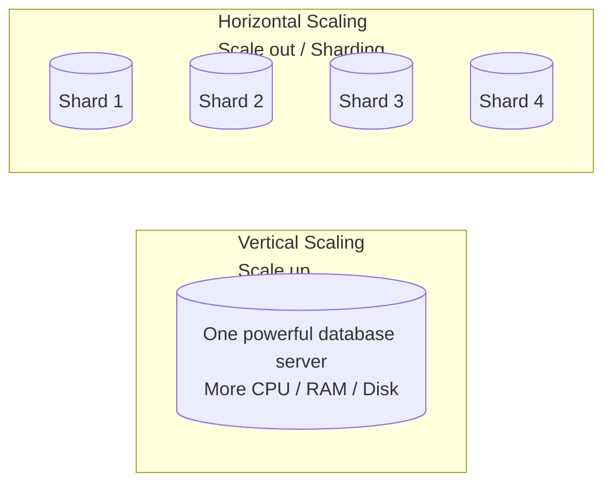
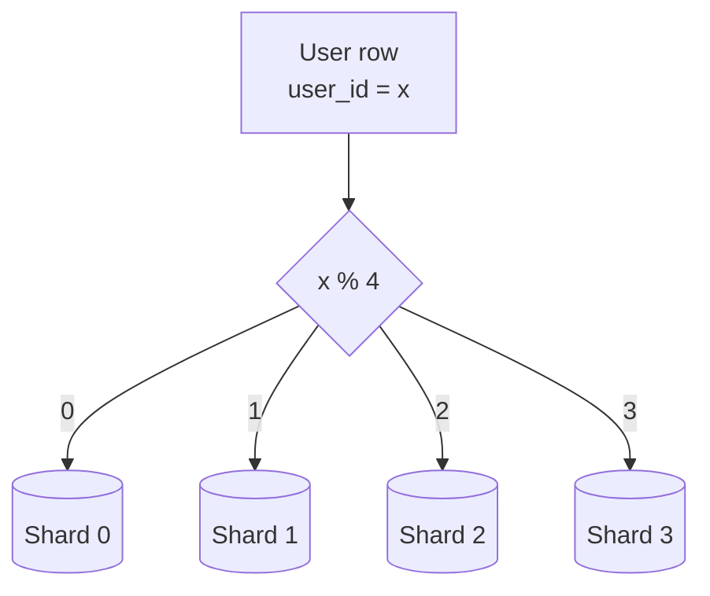
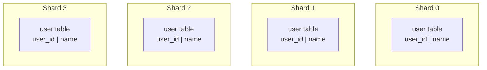
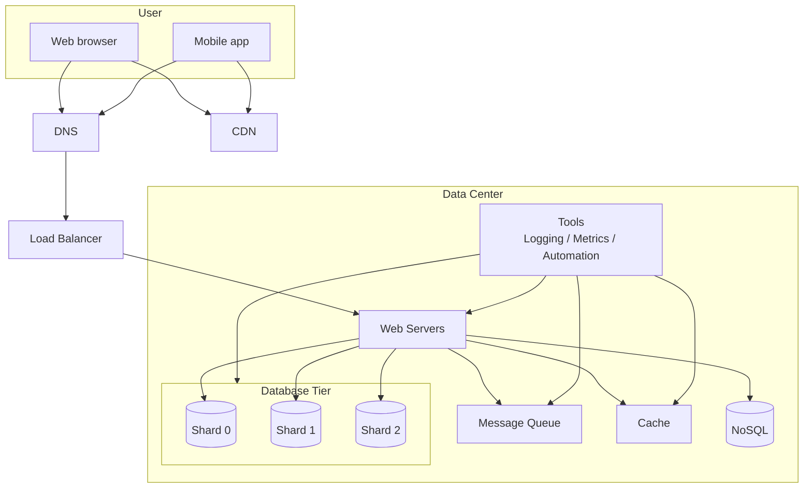

# 10. 数据库扩展与 Sharding

## 1. 为什么数据库需要继续扩展

随着数据每天增长，数据库会越来越 overloaded。即使前面已经做了缓存、复制和读写分离，数据库仍然可能遇到瓶颈。

常见瓶颈：

- 单机存储容量不够。
- 写入压力太大。
- 热点数据集中。
- 表太大，查询变慢。
- 索引越来越大。
- 单台数据库无法承载所有数据。

数据库扩展有两种主要方式：

- Vertical scaling
- Horizontal scaling，也叫 sharding

## 2. Vertical Scaling 垂直扩展数据库

垂直扩展也叫 scale up，指给现有数据库服务器增加更多资源：

- CPU
- RAM
- Disk
- SSD
- 网络带宽

截图中提到，例如 Amazon RDS 可以提供很大内存的数据库服务器。

优点：

- 简单直接。
- 不需要改变应用层的数据访问逻辑。
- 对早期系统很有用。

缺点：

- 硬件有上限。
- 机器越强越贵。
- 单点故障风险仍然存在。
- 大用户量下单台数据库仍然不够。

截图中列出的缺点包括：

- 可以加更多 CPU、RAM 等，但有硬件限制。
- 用户量很大时，单台服务器不够。
- 单点故障风险更高。
- 强机器整体成本更贵。

## 3. Horizontal Scaling 水平扩展数据库

水平扩展也叫 sharding，指添加更多数据库服务器，把数据分散到多个节点。

核心思想：

- 不把所有数据放在一台数据库。
- 按某种规则把数据切成多个 shard。
- 每个 shard 只保存一部分数据。

## 4. 图 1-20：Vertical Scaling vs Horizontal Scaling



垂直扩展是增强一台机器；水平扩展是增加多台机器。

## 5. Sharding 是什么

Sharding 把大数据库拆成更小、更容易管理的部分。每个 shard 共享同样 schema，但保存不同数据。

例子：

- Shard 0 保存一部分用户。
- Shard 1 保存另一部分用户。
- Shard 2 保存另一部分用户。
- Shard 3 保存另一部分用户。

## 6. Sharding Key

Sharding key 决定一条数据应该放在哪个 shard。

截图中例子使用 `user_id` 作为 sharding key。

哈希函数：

```text
user_id % 4
```

如果结果是 0，放到 Shard 0；如果结果是 1，放到 Shard 1，以此类推。

## 7. 图 1-21：按 user_id 分片



## 8. 图 1-22：用户表分片示例

截图中显示同一张 user table 被拆到多个 shard，每个 shard 有相同 schema，但保存不同用户记录。



## 9. 选择 Sharding Key 的重要性

Sharding key 是分片设计中最重要的因素之一。

好的 sharding key 应该：

- 能均匀分布数据。
- 能均匀分布请求。
- 符合主要查询模式。
- 尽量减少跨 shard 查询。

坏的 sharding key 会导致：

- 某些 shard 特别大。
- 某些 shard 特别热。
- 查询需要访问多个 shard。
- 后续扩容和迁移困难。

## 10. Sharding 带来的问题

截图中提到 sharding 是很好的扩展技术，但会给系统带来复杂性和新挑战。

### 10.1 Resharding Data

当数据增长很快，单个 shard 又满了，就需要 resharding。

resharding 的原因：

- 某个 shard 数据太多。
- 某个 shard 请求太热。
- 需要增加更多 shard。

难点：

- 要迁移大量数据。
- 迁移期间不能影响线上请求。
- 需要更新路由规则。
- 可能出现数据不一致。

### 10.2 Celebrity Problem / Hotspot Key Problem

热点 key 问题也叫 celebrity problem。

例子：

- Katy Perry、Justin Bieber、Lady Gaga 这类名人用户都在同一个 shard。
- 这个 shard 会被大量请求打爆。
- 即使其他 shard 很空，整体系统仍然被热点拖慢。

解决思路：

- 对热点用户单独分片。
- 对热点数据做缓存。
- 对单个大 key 做进一步拆分。
- 读请求走 CDN 或缓存。
- 使用一致性哈希或更细粒度分片。

### 10.3 Join and Denormalization

数据被拆到多个 shard 后，跨 shard join 会很难。

传统单库中可以：

```sql
SELECT *
FROM users
JOIN orders ON users.id = orders.user_id;
```

但如果 users 和 orders 分布在不同 shard，join 成本很高。

常见解决方式：

- 反范式化 denormalization。
- 在表中冗余一些字段。
- 应用层做聚合。
- 根据查询模式设计分片。
- 避免跨 shard join。

Denormalization 的代价：

- 写入时要更新多份数据。
- 数据一致性更难。
- 存储空间增加。

## 11. 图 1-23：加入 Sharding 后的架构

截图中的更新架构包含：

- Web Server
- Message Queue
- Cache
- NoSQL
- Sharded Database
- Tools
- CDN
- Load Balancer



## 12. 面试复习点

- 数据库扩展有 scale up 和 scale out 两种方式。
- 垂直扩展简单但有硬件上限和单点问题。
- 水平扩展数据库通常叫 sharding。
- Sharding key 决定数据如何分布，非常关键。
- `user_id % N` 是常见但简单的分片方式。
- Sharding 会带来 resharding、hotspot key、cross-shard join 等问题。
- Denormalization 可以减少 join，但会增加数据冗余和一致性复杂度。
