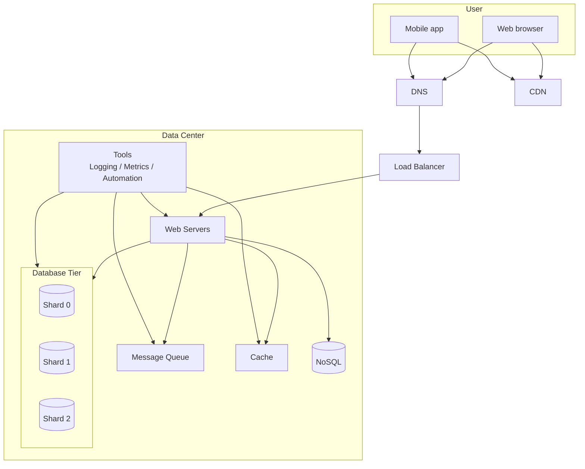

# 11. Millions of Users and Beyond 总结

## 1. 系统扩展是迭代过程

截图中最后一节说：Scaling the system is an iterative process。系统扩展不是一次性完成的，而是不断学习、发现瓶颈、细化设计、引入新策略的过程。

当系统从零增长到百万用户时，你不会一开始就把所有复杂组件都加进去。更合理的方式是：

1. 从简单架构开始。
2. 观察系统瓶颈。
3. 针对瓶颈加组件。
4. 继续监控和优化。

## 2. 图 1-23：百万级系统综合架构

这一章末尾的图把前面提到的组件组合在一起：

这张图不是说所有系统都必须长这样，而是展示随着规模增长可能需要引入的组件。

## 3. 本章总结清单

截图最后给出的总结包括：

- Keep web tier stateless
- Build redundancy at every tier
- Cache data as much as you can
- Support multiple data centers
- Host static assets in CDN
- Scale your data tier by sharding
- Split tiers into individual services
- Monitor your system and use automation tools

下面逐条整理。

## 4. Keep Web Tier Stateless

Web 层保持无状态，可以让任何 Web Server 处理任何请求。

好处：

- 方便水平扩展。
- 方便负载均衡。
- 单台机器故障影响更小。
- 自动扩缩容更简单。

状态应该放在共享存储中，例如 Redis、数据库或分布式 session store。

## 5. Build Redundancy at Every Tier

每一层都要避免单点故障。

需要冗余的层：

- Web Server 多副本。
- Load Balancer 高可用。
- Cache 集群。
- Database 复制。
- Message Queue 多节点。
- 多数据中心容灾。

冗余的核心目标是：一台机器或一个节点挂掉，系统仍能继续服务。

## 6. Cache Data as Much as You Can

缓存可以显著降低数据库压力和响应延迟。

适合缓存：

- 热点数据。
- 静态或半静态数据。
- 计算成本高的数据。
- 读多写少的数据。

但缓存也要处理：

- TTL。
- 一致性。
- 淘汰策略。
- 缓存穿透、击穿、雪崩。

## 7. Support Multiple Data Centers

多数据中心可以提升：

- 全球访问延迟。
- 可用性。
- 灾备能力。

但也引入挑战：

- GeoDNS / Traffic routing。
- 数据同步。
- 跨地域一致性。
- 故障切换。
- 多区域部署和测试。

## 8. Host Static Assets in CDN

静态资源应该放在 CDN：

- 图片
- 视频
- CSS
- JavaScript
- 字体

CDN 的作用：

- 降低用户访问延迟。
- 减轻源站压力。
- 提升静态资源吞吐能力。

## 9. Scale Data Tier by Sharding

当单库无法承载数据量和请求量时，需要通过 sharding 扩展数据层。

关键点：

- 选择合适 sharding key。
- 避免热点 shard。
- 处理 resharding。
- 避免跨 shard join。
- 必要时做 denormalization。

## 10. Split Tiers into Individual Services

当系统继续变大，可以把不同层或不同业务拆成独立服务。

例子：

- User Service
- Order Service
- Feed Service
- Search Service
- Notification Service
- Payment Service

拆分服务的好处：

- 不同团队可以独立开发。
- 不同服务可以独立扩展。
- 故障隔离更好。
- 部署更灵活。

代价：

- 服务间通信复杂。
- 数据一致性更难。
- 监控和排查更难。
- 需要更成熟的自动化和治理能力。

## 11. Monitor Your System and Use Automation Tools

大规模系统必须依赖监控和自动化。

需要监控：

- QPS
- Error rate
- Latency
- CPU / Memory / Disk / Network
- Cache hit rate
- Queue backlog
- Database performance
- Business metrics

自动化包括：

- 自动部署。
- 自动测试。
- 自动扩缩容。
- 自动回滚。
- 自动告警。
- 自动故障恢复。

## 12. 面试回答模板

如果面试官问“如何把系统扩展到百万用户以上”，可以这样回答：

> 我会从简单架构开始，根据瓶颈逐步演进。首先让 Web 层无状态，并通过负载均衡水平扩展 Web Server；每一层都要做冗余，避免单点故障。读多的数据尽量缓存，图片、视频、CSS、JavaScript 等静态资源放到 CDN。数据库层面先做复制和读写分离，当单库无法承载时再做 sharding。对于耗时任务，例如图片处理、邮件通知、搜索索引更新，我会用消息队列异步处理。随着系统变大，需要把不同模块拆成独立服务，并配套日志、监控、指标和自动化部署。多地域用户场景下，还需要支持多个数据中心，同时解决流量路由、数据同步和一致性问题。

## 13. 最终复习重点

- 扩展系统是迭代过程，不是一次性堆组件。
- 无状态 Web 层是水平扩展的基础。
- 每一层都要有冗余。
- 缓存和 CDN 分别优化动态读路径和静态资源路径。
- 数据库复制解决读扩展和可用性，sharding 解决数据规模瓶颈。
- 消息队列解耦生产者和消费者，适合异步任务。
- 日志、指标、监控和自动化是大规模系统的必需品。
- 服务拆分可以提升独立扩展能力，但会引入分布式复杂度。
