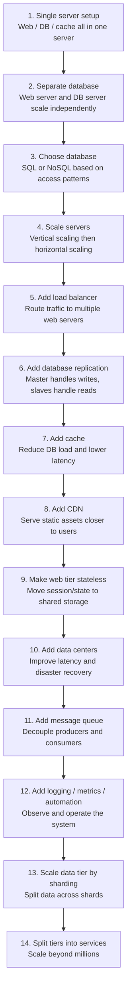

# Scale from Zero to Millions of Users 复习笔记

这组笔记整理自截图内容，按照书中从单机系统逐步扩展到百万用户的演进路线拆分。每篇笔记都包含核心概念、架构图还原、设计原因、优缺点和面试复习点。

## 笔记目录

1. [单服务器架构与请求流程](01-single-server-and-request-flow.md)
   - [面试题补充：单服务器架构与请求流程](01-single-server-and-request-flow-interview-questions.md)
2. [数据库拆分、数据库选择与扩展方式](02-database-and-scaling.md)
   - [面试题补充：数据库选择与扩展方式](02-database-and-scaling-interview-questions.md)
3. [负载均衡与数据库复制](03-load-balancer-and-replication.md)
   - [面试题补充：负载均衡与数据库复制](03-load-balancer-and-replication-interview-questions.md)
4. [缓存 Cache](04-cache.md)
   - [面试题补充：缓存](04-cache-interview-questions.md)
5. [CDN 内容分发网络](05-cdn.md)
   - [面试题补充：CDN 内容分发](05-cdn-interview-questions.md)
6. [无状态 Web 层](06-stateless-web-tier.md)
   - [面试题补充：无状态 Web 层](06-stateless-web-tier-interview-questions.md)
7. [数据中心 Data Centers](07-data-centers.md)
   - [面试题补充：多数据中心](07-data-centers-interview-questions.md)
8. [消息队列 Message Queue](08-message-queue.md)
   - [面试题补充：消息队列](08-message-queue-interview-questions.md)
9. [日志、指标与自动化](09-logging-metrics-automation.md)
   - [面试题补充：日志、指标与自动化](09-logging-metrics-automation-interview-questions.md)
10. [数据库扩展与 Sharding](10-database-scaling-and-sharding.md)
    - [面试题补充：数据库扩展与分片](10-database-scaling-and-sharding-interview-questions.md)
11. [Millions of Users and Beyond 总结](11-millions-and-beyond-summary.md)
    - [面试题补充：百万用户综合设计](11-millions-and-beyond-summary-interview-questions.md)

## 面试题补充说明

补充文件仅列公司、题目、参考答案和来源。题目依据公开面试反馈整理，答案为学习参考。

## 总体演进路线

## 一句话总览

从零到百万用户的系统设计，不是一次性设计出复杂架构，而是在流量增长时逐步识别瓶颈：先拆数据库，再水平扩展 Web 层，加负载均衡和数据库复制，随后用缓存和 CDN 降低延迟，通过无状态 Web 层和多数据中心提升可扩展性与容灾能力，再用消息队列、日志监控自动化、数据库分片和服务拆分继续支撑更大规模。
