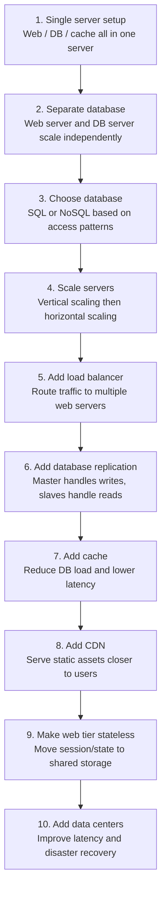

# Scale from Zero to Millions of Users 复习笔记

这组笔记整理自截图内容，按照书中从单机系统逐步扩展到百万用户的演进路线拆分。每篇笔记都包含核心概念、架构图还原、设计原因、优缺点和面试复习点。

## 笔记目录

1. [单服务器架构与请求流程](01-single-server-and-request-flow.md)
2. [数据库拆分、数据库选择与扩展方式](02-database-and-scaling.md)
3. [负载均衡与数据库复制](03-load-balancer-and-replication.md)
4. [缓存 Cache](04-cache.md)
5. [CDN 内容分发网络](05-cdn.md)
6. [无状态 Web 层](06-stateless-web-tier.md)
7. [数据中心 Data Centers](07-data-centers.md)

## 总体演进路线

## 一句话总览

从零到百万用户的系统设计，不是一次性设计出复杂架构，而是在流量增长时逐步识别瓶颈：先拆数据库，再水平扩展 Web 层，加负载均衡和数据库复制，随后用缓存和 CDN 降低延迟，最后通过无状态 Web 层和多数据中心提升可扩展性与容灾能力。
